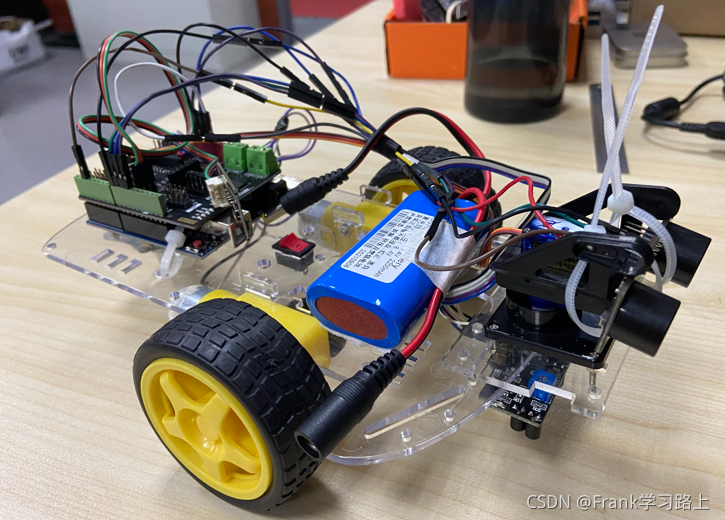
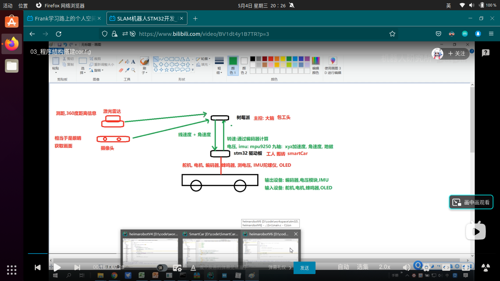

# 项目展示
自主移动机器人，或者说无人驾驶车辆，一般有三大子系统：

    1.环境感知子系统（Perception）

    无人驾驶车辆通过传感器来获取环境信息，主要包括环境感知、建图、定位等。

    2.行为决策子系统（Planning）

    结合导航目标、环境信息、交通规则等信息规划出一条精密的行驶轨迹，无人车沿着这条轨迹移动就能到达终点。

    3.运动控制子系统（Control）

    结合行为决策子系统规划的轨迹和车辆当前状态，位置、姿态和速度等，得出无人车的控制量，油门、档位、转向等。

## Arduino智能车

[原文链接](https://blog.csdn.net/qq_40344790/article/details/120357472?spm=1001.2014.3001.5501)

#### 嵌入视频
<iframe src="////player.bilibili.com/player.html?aid=891516639&bvid=BV1JP4y1j7t4&cid=440414056&page=1" scrolling="no" border="0" frameborder="no" framespacing="0" allowfullscreen="true"  width="700px" height="472px"> </iframe>

## ROS智能车
### 树莓派+arduino
#### 概况：
arduino单独实现了循迹+停障功能，另外还用oled显示屏显示出了超声波探测距离。

树莓派单独实现了相机和激光雷达数据的查看。

两者结合时，ros-arduino-bridge包编译不正常，待解决。

- Jetson nano

## 智能线控底盘车
### x86工控机
#### 概况：
基于Qt实现GPS+IMU数据读取、毫米波数据读取、线控底盘控制，最终实现车辆循迹+停障功能。

## WebGL网页端模型展示
[Hello,WebGL!](https://frankwang98.gitee.io/love)
