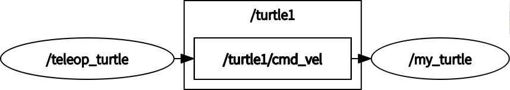

# ROS机器人操作系统集成

## ROS学习入门
### 一、ROS介绍
ros是机器人操作系统（Robot Operating System）的英文缩写。ROS是用于编写机器人软件程序的一种具有高度灵活性的软件架构。ROS的原型源自斯坦福大学的Stanford Artificial Intelligence Robot (STAIR) 和 Personal Robotics (PR)项目。

ROS的4大优势：

	1. 通道：ROS提供了一种发布-订阅式的通信框架用以简单、快速地构建分布式计算系。——计算图级
	2. 工具：ROS提供了大量的工具组合用以配置、启动、自检、调试、可视化、登录、测试、终止分布式计算系统。
	3. 强大的库：ROS提供了广泛的库文件实现以机动性、操作控制、感知为主的机器人功能。
	4. 生态系统：ROS的支持与发展依托着一个强大的社区。ros.org尤其关注兼容性和支持文档，提供了一套“一站式”的方案使得用户得以搜索并学习来自全球开发者数以千计的ROS程序包。——社区级
	另外，在ROS三个级中还有一个文件系统级，后面会有介绍。

主要功能：

	1. ROS提供一些标准操作系统服务，例如硬件抽象，底层设备控制，常用功能实现，进程间消息以及数据包管理。ROS是基于一种图状架构，从而不同节点的进程能接受，发布，聚合各种信息（例如传感，控制，状态，规划等等）。
	2. ROS可以分成两层，低层是上面描述的操作系统层，高层则是广大用户群贡献的实现不同功能的各种软件包，例如定位绘图，行动规划，感知，模拟等等。
### 二、ROS环境搭建
推荐使用“鱼香ROS”大佬的一键安装命令：`wget http://fishros.com/install -O fishros && . fishros `

我自己安装的记录：[原文链接](https://blog.csdn.net/qq_40344790/article/details/118151162)

安装好后，可通过`roscore`命令进行主节点测试，将出现以下信息：
```
    .. logging to /home/ubuntu/.ros/log/cb38e680-dee2-11ea-bae1-70665563e003/roslaunch-nx-1205.log
Checking log directory for disk usage. This may take a while.
Press Ctrl-C to interrupt
Done checking log file disk usage. Usage is <1GB.

started roslaunch server http://nx:36773/
ros_comm version 1.14.7


SUMMARY
========

PARAMETERS
 * /rosdistro: melodic
 * /rosversion: 1.14.7

NODES

auto-starting new master
process[master]: started with pid [1215]
ROS_MASTER_URI=http://nx:11311/

setting /run_id to cb38e680-dee2-11ea-bae1-70665563e003
process[rosout-1]: started with pid [1228]
started core service [/rosout]
```
	关于安装ros及rosdep update更新问题：
	1.目前安装ros基本上是将github的rosdistro转移到gitee实现国内正常安装（用上面的一键安装脚本即可），但安装之后rosdep还是不可用的，对于后面的如导航需要安装的依赖包会有影响；
	2.目前解决rosdep update更新问题主要是通过增加代理访问github实现的，具体实现这里推荐"ncnynl"大佬的一键工具。
	
	具体实现：
	下载脚本：wget https://gitee.com/ncnynl/rosdep/raw/master/rosdep_update.sh ; 		
	管理员给执行权限：sudo chmod +x ./rosdep_update.sh; 	
	管理员运行脚本：sudo ./rosdep_update.sh	
	出现这一行，代表成功：`all files replaced is finished, please continues run rosdecp update`	
	然后执行：`sudo rosdep init` 和 `rosdep update`即可。

### 三、第一个ROS案例
###### 测试案例——小海龟
第一个终端：`roscore`

第二个终端：`rosrun turtlesim turtlesim_node`

第三个终端：`rosrun turtlesim turtle_teleop_key`

启动完成后，将鼠标放在第三个终端上，就可以键盘控制第二个终端启动的小海龟移动了！

###### 编译案例——空程序包
创建工作空间：`mkdir catkin_ws && cd catkin_ws`

创建源文件目录：`mkdir src `

catkin编译：`catkin_make`

最终文件列表：`tree`
```
.
├── build
│   ├── atomic_configure
│   ├── bin
│   ├── catkin
│   ├── catkin_generated
│   ├── CATKIN_IGNORE
│   ├── catkin_make.cache
│   ├── CMakeCache.txt
│   ├── CMakeFiles
│   ├── cmake_install.cmake
│   ├── CTestConfiguration.ini
│   ├── CTestCustom.cmake
│   ├── CTestTestfile.cmake
│   ├── gtest
│   ├── Makefile
│   └── test_results
├── devel
│   ├── cmake.lock
│   ├── env.sh
│   ├── lib
│   ├── local_setup.bash
│   ├── local_setup.sh
│   ├── local_setup.zsh
│   ├── setup.bash
│   ├── setup.sh
│   ├── _setup_util.py
│   └── setup.zsh
└── src
    └── CMakeLists.txt -> /opt/ros/noetic/share/catkin/cmake/toplevel.cmake

11 directories, 18 files
```
###### 创建案例——新程序包
首先切换到catkin工作空间中的src目录下：`cd ~/catkin_ws/src`

使用catkin_create_pkg命令来创建一个名为'beginner_tutorials'的新程序包。		
这个程序包依赖于std_msgs、roscpp和rospy：	
`catkin_create_pkg beginner_tutorials std_msgs rospy roscpp`

这个文件夹里面包含一个package.xml文件（可查看程序依赖的包）和一个CMakeLists.txt文件。

`catkin_make`编译通过。
### 四、ROS文件系统
###### 文件系统概念
1.Packages: 软件包，是ROS应用程序代码的组织单元，每个软件包都可以包含程序库、可执行文件、脚本或者其它手动创建的东西。

2.Manifest (package.xml): 清单，是对于'软件包'相关信息的描述,用于定义软件包相关元信息之间的依赖关系，这些信息包括版本、维护者和许可协议等。

###### 文件系统工具
```
rospack = ros + pack(age) 
rospack find [package_name]

roscd = ros + cd 
roscd [package_name]

rosls = ros + ls 
rosls [package_name]
```

###### rosbag数据录制与回放
值得一提的是rosbag工具的使用。
```
rosbag record -a
rosbag info <your bagfile>
rosbag play (-r 2/-l) <your bagfile>
```

### 五、ROS消息机制
通过ROS计算图来学习ROS的消息通信机制。
###### 计算图概念：

    Nodes:节点,一个节点即为一个可执行文件，它可以通过ROS与其它节点进行通信。
    Messages:消息，消息是一种ROS数据类型，用于订阅或发布到一个话题。
    Topics:话题,节点可以发布消息到话题，也可以订阅话题以接收消息。
    Master:节点管理器，ROS名称服务 (比如帮助节点找到彼此)。
    rosout: ROS中相当于stdout/stderr。
    roscore: 主机+ rosout + 参数服务器 (参数服务器会在后面介绍)。

###### 节点概念：

    一个节点其实只不过是ROS程序包中的一个可执行文件。
    ROS节点可以使用ROS客户库与其他节点通信。
    节点可以发布或接收一个话题。
    节点也可以提供或使用某种服务。

###### 客户端库概念：
ROS客户端库允许使用不同编程语言编写的节点之间互相通信:

    rospy = python 客户端库
    roscpp = c++ 客户端库
    rosjs = javascripts客户端库
    rosjava = java客户端库

###### 节点详解：
######### roscore：
roscore是你在运行所有ROS程序前首先要运行的命令。		
如果roscore运行后无法正常初始化，很有可能是存在网络配置问题。

######### rosnode：

    打开一个新的终端, 可以使用 rosnode 像运行roscore一样看看在运行什么...
    注意: 当打开一个新的终端时，你的运行环境会复位，同时你的~/.bashrc文件会复原。
    如果你在运行类似于rosnode的指令时出现一些问题，
    也许你需要添加一些环境设置文件到你的~/.bashrc或者手动重新配置他们。
    rosnode显示当前运行的ROS节点信息。
    rosnode list指令列出活跃的节点:`rosnode list`
    rosnode info命令返回的是关于一个特定节点的信息:`rosnode info /rosout`

下面，让我们看看更多的节点，为此，我们将使用rosrun弹出另一个节点。

######### rosrun：

rosrun允许你使用包名直接运行一个包内的节点(而不需要知道这个包的路径)。		
用法：`rosrun [package_name] [node_name]`

还是以前面小海龟的例子来说：`rosrun turtlesim turtlesim_node`		
现在我们调用`rosnode list`，会看到多了一个`/turtlesim`节点。

此外，rosrun执行节点时，还可以通过命令行重新配置名称，如下：
`rosrun turtlesim turtlesim_node __name:=my_turtle`		
现在我们重新调用`rosnode list`，会看到节点名称变为`/my_turtle`。		
另外还可以通过`rosnode ping /my_turtle`来测试节点的通讯情况。

###### 话题详解：
以小海龟为例来看其中的话题通讯机制。

######### Topics：

	turtlesim_node节点和turtle_teleop_key节点之间是通过一个ROS话题来互相通信的。
	turtle_teleop_key在一个话题上发布按键输入消息，而turtlesim则订阅该话题以接收该消息。
######### rqt_graph：

	rqt_graph能够创建一个显示当前系统运行情况的动态图形。
	rqt_graph是rqt程序包中的一部分。

下面让我们使用rqt_graph来显示当前运行的节点和话题。		
可以运行`rosrun rqt_graph rqt_graph`，也可以直接输入`rqt_graph`打开。

会出现这个图形：	


表明两个节点之间正通过一个ROS话题来通讯。

######### rostopic：
ros提供的rostopic命令工具能让你获取有关ROS话题的信息。

	rostopic echo [topic] 可以显示在某个话题上发布的数据
	rostopic list 能够列出所有当前订阅和发布的话题，-v可以列出详细信息
	rostopic type [topic] 命令用来查看所发布话题的消息类型

ROS Messages

    话题之间的通信是通过在节点之间发送ROS消息实现的。
    对于发布器(turtle_teleop_key和订阅器(turtulesim_node)之间的通信，发布器和订阅器之间必须发送和接收相同类型的消息。
    这意味着话题的类型是由发布在它上面的消息类型决定的。
    使用rostopic type命令可以查看发布在某个话题上的消息类型。
    使用rosmsg show [topic]命令可以查看消息的详细情况。

例如通过`rosmsg show geometry_msgs/Twist`来查看小海龟运动的消息，显示：
```
geometry_msgs/Vector3 linear
  float64 x
  float64 y
  float64 z
geometry_msgs/Vector3 angular
  float64 x
  float64 y
  float64 z
```
现在我们已经知道了turtlesim节点所期望的消息类型，接下来我们就可以给turtle发布命令了。

我们已经了解了什么是ROS的消息，接下来我们开始结合消息来使用rostopic。

	rostopic pub [topic] [msg_type] [args] 可以把数据发布到当前某个正在广播的话题上
	如：`rostopic pub -1 /turtle1/cmd_vel geometry_msgs/Twist -- '[2.0, 0.0, 0.0]' '[0.0, 0.0, 1.8]'`
	以上命令会发送一条消息给turtlesim，告诉它以2.0大小的线速度和1.8大小的角速度开始移动。
	但上面的命令只会让小海龟移动一次，如果想让小海龟保持运动，可以使用rostopic pub -r命令来发布一个稳定的命令流，
	发布一个频率为1Hz的命令流：`rostopic pub /turtle1/cmd_vel geometry_msgs/Twist -r 1 -- '[2.0, 0.0, 0.0]' '[0.0, 0.0, 1.8]'`

######### rqt_plot
rqt_plot命令可以实时显示一个发布到某个话题上的数据变化图形。

这里我们将使用rqt_plot命令来绘制正在发布到/turtle1/pose话题上的数据变化图形。

可以通过命令`rosrun rqt_plot rqt_plot`启动或直接输入`rqt_plot`

这会弹出一个新窗口，在窗口左上角的一个文本框里面你可以添加需要绘制的话题。		
在里面输入/turtle1/pose/y后之前处于禁用状态的加号按钮将会被使能变亮。
		
可以通过+-号来增加或删除话题。

###### 服务详解：

    服务（services）是节点之间通讯的另一种方式。
    服务允许节点发送请求（request） 并获得一个响应（response），也就是请求-回应式的通讯机制。
######### rosservice
rosservice可以很轻松的使用 ROS 客户端/服务器框架提供的服务。

	rosservice list         输出可用服务的信息
	rosservice call         调用带参数的服务
	rosservice type         输出服务类型
	rosservice find         依据类型寻找服务find services by service type
	rosservice uri          输出服务的ROSRPC uri 
还是以小海龟为例，输入`rosservice list`会显示：
```
/clear(清除)
/kill(终止)
/my_turtle/get_loggers
/my_turtle/set_logger_level
/reset(重置)
/rosout/get_loggers(rosout)
/rosout/set_logger_level(rosout)
/spawn(再生)
/teleop_turtle/get_loggers
/teleop_turtle/set_logger_level
/turtle1/set_pen
/turtle1/teleport_absolute
/turtle1/teleport_relative
```

使用rosservice type [service]命令更进一步查看clear服务，如`rosservice type clear`，会显示：
`std_srvs/Empty`	
服务的类型为空（empty),这表明在调用这个服务是不需要参数（比如，请求不需要发送数据，响应也没有数据）。

因为服务类型为空，通过rosservice call [service] [args]命令调用无参数服务：
`rosservice call clear`		
小海龟的历史轨迹会被清除。

通过查看再生（spawn）服务的信息，我们来了解带参数的服务:
输入`rosservice type spawn | rossrv show`后会显示：
```
float32 x
float32 y
float32 theta
string name
---
string name
```
这个服务使得我们可以在给定的位置和角度生成一只新的乌龟。	
名字参数是可选的，这里我们不设具体的名字，让turtlesim自动创建一个。	
执行命令：`rosservice call spawn 2 2 0.2 ""`		
服务会返回新产生的乌龟的名字： name: turtle2，这就是再生（spawn）。

顺着这个思路，大家可以去试试`/reset(重置)`这个服务的用法。

######### rosparam
rosparam使得我们能够存储并操作ROS参数服务器（Parameter Server）上的数据。
    
参数服务器能够存储整型、浮点、布尔、字符串、字典和列表等数据类型。
rosparam使用YAML标记语言的语法。	
一般而言，YAML的表述很自然：

    1是整型
    1.0是浮点型
    one是字符串
    true是布尔
    [1,2,3]是整型列表
    {a:b,c:d}是字典

rosparam的指令有以下：

	rosparam set            设置参数
	rosparam get            获取参数
	rosparam load           从文件读取参数
	rosparam dump           向文件中写入参数
	rosparam delete         删除参数
	rosparam list           列出参数名

以小海龟为例，我们来看看现在参数服务器上都有哪些参数，执行`rosparam list`会显示：
```
/my_turtle/background_b
/my_turtle/background_g
/my_turtle/background_r(背景色)
/rosdistro
/roslaunch/uris/host_wangzf_lenovo__45571
/rosversion
/run_id
```

改变参数值使用rosparam set [param_name]，获取参数值使用rosparam get [param_name]

现在我们修改背景颜色的红色通道：`rosparam set /my_turtle/background_r 150 `

上述指令修改了参数的值，现在我们调用清除服务(clear)使得修改后的参数生效：`rosservice call clear`

可以使用rosparam get来显示参数服务器上的所有内容：`rosparam get /`

也可以存储这些当前参数以备使用，使用方法如下：
```
rosparam dump [file_name]
rosparam load [file_name] [namespace]	// 可以载入新的命名空间
```

###### roslaunch多节点启动
在说roslaunch之前，提一下ros中有自带的调试工具：`rqt_console和rqt_logger_level`，属于ROS日志框架(logging framework)的一部分，用来显示节点的输出信息和修改日志级别（前面也看到过），如果有需要可以自己去调试用，这里不赘述。

可以通过下面命令启动：
```
rosrun rqt_console rqt_console
rosrun rqt_logger_level rqt_logger_level
```

主要说一下roslaunch的使用：

roslaunch [package] [filename.launch]可以用来启动定义在launch文件中的多个节点。

先切换到beginner_tutorials程序包目录下：`roscd beginner_tutorials`

然后创建一个launch文件夹：`mkdir launch && cd launch`

现在我们来创建一个名为turtle_test.launch的launch文件并复制粘贴以下内容到该文件里面：
```
<launch>

   <group ns="turtlesim1">
     <node pkg="turtlesim" name="sim" type="turtlesim_node"/>
   </group>
 
   <group ns="turtlesim2">
     <node pkg="turtlesim" name="sim" type="turtlesim_node"/>
   </group>
 
   <node pkg="turtlesim" name="mimic" type="mimic">
     <remap from="input" to="turtlesim1/turtle1"/>
     <remap from="output" to="turtlesim2/turtle1"/>
   </node>
 
</launch>
```
launch文件创建完成后，就通过roslaunch命令来启动launch文件：`roslaunch beginner_tutorials turtle_test.launch`

将会有两个turtlesims被启动，然后我们在一个新终端中使用rostopic命令发送速度设定消息：`rostopic pub /turtlesim1/turtle1/cmd_vel geometry_msgs/Twist -r 1 -- '[2.0, 0.0, 0.0]' '[0.0, 0.0, -1.8]'`

你会看到两个turtlesims会同时开始移动，虽然发布命令只是给turtlesim1发送了速度设定消息。

也可以通过rqt_graph来更好的理解在launch文件中所做的事情（节点和话题）。

### 六、话题与服务机制实现
###### 创建ROS消息和ROS服务
######### 消息(msg)和服务(srv)介绍
消息(msg): msg文件就是一个描述ROS中所使用消息类型的简单文本。它们会被用来生成不同语言的源代码。

服务(srv): 一个srv文件描述一项服务。它包含两个部分：请求和响应。

msg文件存放在package的msg目录下，srv文件则存放在srv目录下。

msg文件实际上就是每行声明一个数据类型和变量名。

    可以使用的数据类型如下：
    
    int8, int16, int32, int64 (plus uint*) float32, float64 string time, duration other msg files variable-length array[] and fixed-length array[C]

在ROS中有一个特殊的数据类型：Header，它含有时间戳和坐标系信息。		
下面是一个msg文件的样例，它使用了Header，string，和其他另外两个消息类型。
```
Header header
  string child_frame_id
  geometry_msgs/PoseWithCovariance pose
  geometry_msgs/TwistWithCovariance twist
```
srv服务文件分为请求和响应两部分，由'---'分隔。下面是srv的一个样例：
```
int64 A
int64 B
---
int64 Sum
```
######### 创建一个 msg
首先创建msg文件：`roscd beginner_tutorials && mkdir msg `
将msg消息写入文件（最简单的消息）：`echo "int64 num" > msg/Num.msg`

接下来，还有关键的一步：我们要确保msg文件被转换成为C++，Python和其他语言的源代码：

查看package.xml, 确保它包含一下两条语句，分别是消息的构建与运行:
```
<build_depend>message_generation</build_depend>
<exec_depend>message_runtime</exec_depend>
```
然后在CMakeLists.txt文件中，利用find_packag函数，增加对message_generation的依赖，这样就可以生成消息了。

你可以直接在COMPONENTS的列表里增加message_generation，就像这样：
`find_package(catkin REQUIRED COMPONENTS roscpp rospy std_msgs message_generation)`

同样，你需要确保你设置了运行依赖：
```
catkin_package(
  ...
  CATKIN_DEPENDS message_runtime ...
  ...)
```
找到如下代码块，添加你的msg文件：
```
add_message_files(
  FILES
  Num.msg
)
```
手动添加.msg文件后，我们要确保CMake知道在什么时候重新配置我们的project。

确保添加了如下代码:
```
generate_messages(
   DEPENDENCIES
   std_msgs
)
```
然后执行`catkin_make`，会生成msg消息。

######### 使用 rosmsg
创建完成后，通过rosmsg show命令，检查ROS是否能够识消息。		
`rosmsg show beginner_tutorials/Num`/`rosmsg show Num `	
将会显示：`int64 num`

######### 创建一个srv
`roscd beginner_tutorials && mkdir srv`
这次我们不再手动创建服务，而是从其他的package中复制一个服务。	
roscp [package_name] [file_to_copy_path] [copy_path]是一个很实用的命令行工具，它实现了将文件从一个package复制到另外一个package的功能。

现在我们从rospy_tutorials package中复制一个服务文件：

`roscp rospy_tutorials AddTwoInts.srv srv/AddTwoInts.srv`

还有很关键的一步：我们要确保srv文件被转换成C++，Python和其他语言的源代码。

如前边所介绍的，在CMakeLists.txt文件中增加了对message_generation的依赖(message_generation 对msg和srv都起作用)。

用你自己的srv文件名替换掉那些Service*.srv文件:
```
add_service_files(
  FILES
  AddTwoInts.srv
)
```
同样，跟msg文件类似，你也需要在package.xml文件中做一些修改(增加依赖项)。

现在，你可以生成自己的服务源代码了。

######### 使用 rossrv
同样可以通过rossrv show命令，检查ROS是否能够识该服务：	
`rossrv show beginner_tutorials/AddTwoInts`/`rossrv show AddTwoInts`

将会显示：
```
[rospy_tutorials/AddTwoInts]:
int64 a
int64 b
---
int64 sum

[beginner_tutorials/AddTwoInts]:
int64 a
int64 b
---
int64 sum
```

###### C++编写简单的消息发布器和订阅器
基于消息，编写发布器节点和订阅器节点，实现话题通信。

进入源文件目录：`roscd beginner_tutorials/src`		
######### 发布器
创建 talker.cpp 文件并粘贴代码：
```
/* 
 * 代码思路如下：
 * 1.初始化ROS系统
 * 2.在ROS网络内广播我们将要在chatter topic上发布std_msgs/String消息
 * 3.以每秒10次的频率在chatter上发布消息
*/ 
##include "ros/ros.h"
##include "std_msgs/String.h"

##include <sstream>

/**
 * This tutorial demonstrates simple sending of messages over the ROS system.
 */
int main(int argc, char **argv)
{
  /**
   * The ros::init() function needs to see argc and argv so that it can perform
   * any ROS arguments and name remapping that were provided at the command line. For programmatic
   * remappings you can use a different version of init() which takes remappings
   * directly, but for most command-line programs, passing argc and argv is the easiest
   * way to do it.  The third argument to init() is the name of the node.
   *
   * You must call one of the versions of ros::init() before using any other
   * part of the ROS system.
   */
  ros::init(argc, argv, "talker");

  /**
   * NodeHandle is the main access point to communications with the ROS system.
   * The first NodeHandle constructed will fully initialize this node, and the last
   * NodeHandle destructed will close down the node.
   */
  ros::NodeHandle n;

  /**
   * The advertise() function is how you tell ROS that you want to
   * publish on a given topic name. This invokes a call to the ROS
   * master node, which keeps a registry of who is publishing and who
   * is subscribing. After this advertise() call is made, the master
   * node will notify anyone who is trying to subscribe to this topic name,
   * and they will in turn negotiate a peer-to-peer connection with this
   * node.  advertise() returns a Publisher object which allows you to
   * publish messages on that topic through a call to publish().  Once
   * all copies of the returned Publisher object are destroyed, the topic
   * will be automatically unadvertised.
   *
   * The second parameter to advertise() is the size of the message queue
   * used for publishing messages.  If messages are published more quickly
   * than we can send them, the number here specifies how many messages to
   * buffer up before throwing some away.
   */
  ros::Publisher chatter_pub = n.advertise<std_msgs::String>("chatter", 1000);

  ros::Rate loop_rate(10);

  /**
   * A count of how many messages we have sent. This is used to create
   * a unique string for each message.
   */
  int count = 0;
  while (ros::ok())
  {
    /**
     * This is a message object. You stuff it with data, and then publish it.
     */
    std_msgs::String msg;

    std::stringstream ss;
    ss << "hello ! ROS world !" << count;
    msg.data = ss.str();

    ROS_INFO("%s", msg.data.c_str());

    /**
     * The publish() function is how you send messages. The parameter
     * is the message object. The type of this object must agree with the type
     * given as a template parameter to the advertise<>() call, as was done
     * in the constructor above.
     */
    chatter_pub.publish(msg);

    ros::spinOnce();

    loop_rate.sleep();
    ++count;
  }

  return 0;
}
```
######### 订阅器
创建 listener.cpp 文件并粘贴以下代码：
```
/*
 * 1.初始化ROS系统
 * 2.订阅chatter topic
 * 3.进入自循环，等待消息的到达
 * 4.当消息到达，调用chatterCallback()函数
*/
##include "ros/ros.h"
##include "std_msgs/String.h"

/**
 * This tutorial demonstrates simple receipt of messages over the ROS system.
 */
// 回调函数
void chatterCallback(const std_msgs::String::ConstPtr& msg)
{
  ROS_INFO("I heard: [%s]", msg->data.c_str());
}

int main(int argc, char **argv)
{
  /**
   * The ros::init() function needs to see argc and argv so that it can perform
   * any ROS arguments and name remapping that were provided at the command line. For programmatic
   * remappings you can use a different version of init() which takes remappings
   * directly, but for most command-line programs, passing argc and argv is the easiest
   * way to do it.  The third argument to init() is the name of the node.
   *
   * You must call one of the versions of ros::init() before using any other
   * part of the ROS system.
   */
  ros::init(argc, argv, "listener");

  /**
   * NodeHandle is the main access point to communications with the ROS system.
   * The first NodeHandle constructed will fully initialize this node, and the last
   * NodeHandle destructed will close down the node.
   */
  ros::NodeHandle n;

  /**
   * The subscribe() call is how you tell ROS that you want to receive messages
   * on a given topic.  This invokes a call to the ROS
   * master node, which keeps a registry of who is publishing and who
   * is subscribing.  Messages are passed to a callback function, here
   * called chatterCallback.  subscribe() returns a Subscriber object that you
   * must hold on to until you want to unsubscribe.  When all copies of the Subscriber
   * object go out of scope, this callback will automatically be unsubscribed from
   * this topic.
   *
   * The second parameter to the subscribe() function is the size of the message
   * queue.  If messages are arriving faster than they are being processed, this
   * is the number of messages that will be buffered up before beginning to throw
   * away the oldest ones.
   */
  ros::Subscriber sub = n.subscribe("chatter", 1000, chatterCallback);

  /**
   * ros::spin() will enter a loop, pumping callbacks.  With this version, all
   * callbacks will be called from within this thread (the main one).  ros::spin()
   * will exit when Ctrl-C is pressed, or the node is shutdown by the master.
   */
  ros::spin();		// 自循环

  return 0;
}
```
######### 编译节点
调整 package.xml 和 CMakeLists.txt 文件。

在CMakeLists.txt文件末尾加入几条语句:
```
include_directories(include ${catkin_INCLUDE_DIRS})

add_executable(talker src/talker.cpp)
target_link_libraries(talker ${catkin_LIBRARIES})

add_executable(listener src/listener.cpp)
target_link_libraries(listener ${catkin_LIBRARIES})
```
这会生成两个可执行文件, talker 和 listener, 默认存储到devel/lib目录

然后运行`catkin_make`编译。

启动：
```
rosrun beginner_tutorials talker
rosrun beginner_tutorials listener  
```

###### Python编写简单的消息发布器和订阅器
######### 发布器
进入并创建目录：`roscd beginner_tutorials && mkdir scripts && cd scripts`		
创建 talker.py ，写入以下代码：
```
##!/usr/bin/env python
import rospy
from std_msgs.msg import String

def talker():
    pub = rospy.Publisher('chatter', String, queue_size=10)
    rospy.init_node('talker', anonymous=True)
    rate = rospy.Rate(10) ## 10hz
    while not rospy.is_shutdown():
        hello_str = "hello world %s" % rospy.get_time()
        rospy.loginfo(hello_str)
        pub.publish(hello_str)
        rate.sleep()

if __name__ == '__main__':
    try:
        talker()
    except rospy.ROSInterruptException:
        pass
    '''
    标准的Python main检查，这个会捕获rospy.ROSInterruptException异常，当按下Ctrl-C或节点关闭的话，即使在rospy.sleep()和rospy.Rate.sleep()函数里都会抛出异常。
    '''
```
######### 订阅器
创建 listener.py ，写入以下代码：
```
##!/usr/bin/env python
import rospy
from std_msgs.msg import String

## 新增加的函数回调机制
def callback(data):
    rospy.loginfo(rospy.get_caller_id() + 'I heard %s', data.data)

def listener():

    ## In ROS, nodes are uniquely named. If two nodes with the same
    ## name are launched, the previous one is kicked off. The
    ## anonymous=True flag means that rospy will choose a unique
    ## name for our 'listener' node so that multiple listeners can
    ## run simultaneously.
    rospy.init_node('listener', anonymous=True)

    rospy.Subscriber('chatter', String, callback)

    ## spin() simply keeps python from exiting until this node is stopped
    rospy.spin()

if __name__ == '__main__':
    listener()
```
######### 编译节点
我们使用CMake作为构建系统，即使是Python节点也需要使用。

`catkin_make`编译完成。

启动：
```
rosrun beginner_tutorials talker.py 
rosrun beginner_tutorials listener.py 
```

###### C++编写简单的Service和Client
######### 服务端
创建 src/add_two_ints_server.cpp 文件，并粘贴下面的代码：
```
##include "ros/ros.h"
##include "beginner_tutorials/AddTwoInts.h"

bool add(beginner_tutorials::AddTwoInts::Request  &req,
         beginner_tutorials::AddTwoInts::Response &res)
{
  res.sum = req.a + req.b;
  ROS_INFO("request: x=%ld, y=%ld", (long int)req.a, (long int)req.b);
  ROS_INFO("sending back response: [%ld]", (long int)res.sum);
  return true;
}

int main(int argc, char **argv)
{
  ros::init(argc, argv, "add_two_ints_server");
  ros::NodeHandle n;

  ros::ServiceServer service = n.advertiseService("add_two_ints", add);
  ROS_INFO("Ready to add two ints.");
  ros::spin();

  return 0;
}
```
######### 客户端
创建src/add_two_ints_client.cpp文件，并粘贴下面的代码：
```
##include "ros/ros.h"
##include "beginner_tutorials/AddTwoInts.h"
##include <cstdlib>

int main(int argc, char **argv)
{
  ros::init(argc, argv, "add_two_ints_client");
  if (argc != 3)
  {
    ROS_INFO("usage: add_two_ints_client X Y");
    return 1;
  }

  ros::NodeHandle n;
  ros::ServiceClient client = n.serviceClient<beginner_tutorials::AddTwoInts>("add_two_ints");
  beginner_tutorials::AddTwoInts srv;
  srv.request.a = atoll(argv[1]);
  srv.request.b = atoll(argv[2]);
  if (client.call(srv))
  {
    ROS_INFO("Sum: %ld", (long int)srv.response.sum);
  }
  else
  {
    ROS_ERROR("Failed to call service add_two_ints");
    return 1;
  }

  return 0;
}
```
######### 编译节点
再来编辑一下beginner_tutorials里面的CMakeLists.txt

```
add_executable(add_two_ints_server src/add_two_ints_server.cpp)
target_link_libraries(add_two_ints_server ${catkin_LIBRARIES})
add_dependencies(add_two_ints_server beginner_tutorials_gencpp)

add_executable(add_two_ints_client src/add_two_ints_client.cpp)
target_link_libraries(add_two_ints_client ${catkin_LIBRARIES})
add_dependencies(add_two_ints_client beginner_tutorials_gencpp)
```

这段代码将生成两个可执行程序"add_two_ints_server"和"add_two_ints_client"，这两个可执行程序默认被放在你的devel/lib下的包目录下。

可以直接调用可执行程序，或者使用rosrun命令去调用它们。

`catkin_make`编译完成。

###### Python编写简单的Service和Client
######### 服务端
创建scripts/add_two_ints_server.py文件，并粘贴以下内容：
```
##!/usr/bin/env python

from beginner_tutorials.srv import *
import rospy

def handle_add_two_ints(req):
    print "Returning [%s + %s = %s]"%(req.a, req.b, (req.a + req.b))
    return AddTwoIntsResponse(req.a + req.b)

def add_two_ints_server():
    rospy.init_node('add_two_ints_server')
    s = rospy.Service('add_two_ints', AddTwoInts, handle_add_two_ints)
    print "Ready to add two ints."
    rospy.spin()

if __name__ == "__main__":
    add_two_ints_server()
```

######### 客户端
创建scripts/add_two_ints_client.py文件，并粘贴以下内容：
```
##!/usr/bin/env python

import sys
import rospy
from beginner_tutorials.srv import *

def add_two_ints_client(x, y):
    rospy.wait_for_service('add_two_ints')
    try:
        add_two_ints = rospy.ServiceProxy('add_two_ints', AddTwoInts)
        resp1 = add_two_ints(x, y)
        return resp1.sum
    except rospy.ServiceException, e:
        print "Service call failed: %s"%e

def usage():
    return "%s [x y]"%sys.argv[0]

if __name__ == "__main__":
    if len(sys.argv) == 3:
        x = int(sys.argv[1])
        y = int(sys.argv[2])
    else:
        print usage()
        sys.exit(1)
    print "Requesting %s+%s"%(x, y)
    print "%s + %s = %s"%(x, y, add_two_ints_client(x, y))
```
######### 编译节点
`catkin_make`编译完成。

执行：
```
rosrun beginner_tutorials add_two_ints_server.py
rosrun beginner_tutorials add_two_ints_client.py
```
注意：python2 和 python3 语法有区别的。

### 七、ROS常用工具
###### rqt
rqt 是ROS提供的 GUI 工具集。

前面我们已经用过rqt工具的一部分，现在我们来整理了解一下：

通过`rqt`命令打开该工具。

###### rviz
RViz是一款强大的可视化工具，它允许你查看机器人中的传感器和内部状态。

通过`rviz`命令打开该工具。

可以通过Add添加想要Display的Topics，并且可以配置其参数。

还可以从不同的视角来看当前机器人的状态，尤其在机器人导航时很有用。

底部会显示Time，即ROS系统的内部时钟。

### 八、ROS入门总结
###### 总结
- 此时你应该已经对ROS中的一些核心概念有了一定的理解。
- 给你一台运行ROS的机器人，你应该能够运用所学知识来列出机器人上发布和订阅的各种话题（topic），查看话题中发布的消息，然后编写你自己的节点（node）来处理传感器数据，最后让机器人在真实环境中动起来。
- ROS真正的吸引力不在于它自己发布或订阅的中间件，而在于ROS为世界各地的开发者提供了一种标准机制来分享他们的代码。
- ROS最大的特色在于庞大的社区。
- 大量现成可用的程序包（packages）已经势不可挡。

###### 接下来做什么？
ROS作为一种机器人软件开发平台，学习完基本概念后，我们可以从一辆真实的机器人或者一个模拟器入手，学习其底盘控制、传感器数据获取、导航算法、规划算法等，先用所学的节点等概念去全面了解Robot，然后再去钻研自己感兴趣的那一方面。

ROS入门完！[ROS Distro](https://www.ncnynl.com/archives/201907/3173.html)

有兴趣的也可以看看[《ROS史话36篇》](https://www.ncnynl.com/archives/201907/3152.html)，出自[华东师范大学-张新宇老师](https://faculty.ecnu.edu.cn/_s43/zxy2/main.psp)。

摘抄：
```
计算机使用的操作系统，英语称为Operating System，缩写为OS。它是一种计算机程序，帮助使用计算机的人操控计算机硬件、管理各种应用软件。

人们听说过的硬件包括：CPU、主板、内存、硬盘、显示器、打印机、U盘等；人们常用的应用软件有：文字处理软件，比如微软开发的Word，幻灯片制作软件，比如微软开发的PowerPoint，看电影的软件，比如微软的视频播放器，浏览网页的软件，比如谷歌的Chrome、聊天软件，比如腾讯的QQ和微信等等。

一开始，计算机比较简单，并没有操作系统，人们通过各种操作按钮就可以控制计算机，但是这种操作方式效率比较低。后来人们通过有孔的纸带将程序输入计算机进行编译，再通过程序员自己编写的程序运行，这种方式效率还是很低。为了更有效的管理计算机硬件，并提高计算机程序的开发效率，就出现了操作系统。

与计算机操作系统类似，机器人操作系统的出现也遵循这样一个规律：为了提高机器人设计和开发的效率。机器人操作系统英语称为Robot Operating System，缩写为ROS。

2009年摩根·奎格利(吴恩达学生)、吴恩达和柳树车库机器人公司的工程师们，在当年的IEEE国际机器人与自动化会议上发表了《ROS: An Open-Source Robot Operating System》，正式向外界介绍ROS。

正如文章中说强调的：

ROS is not an operating system in the traditional sense of process management and scheduling; rather, it provides a structured communications layer above the host operating systems of a heterogenous compute cluster.

（译文：ROS不是传统意义上的操作系统，不是用于进程管理和调度，而是构建在其它操作系统之上的一种结构化的通讯层。）

从2008年开始，柳树车库机器人开始主导ROS的开发，奎格利因为还没有毕业，但以学生兼职的形式指导着ROS的进展。

2010年，随着PR2正式对外发布，柳树车库机器人也正式推出ROS正式开发版，这就是ROS 1.0。

ROS秉承“开源”的原则，与全球开发者一起推动机器人事业。

2012年，摩根·奎格利终于博士毕业了，他选择作为首席架构师，与布莱恩·格基（Brian Gerkey，CEO）、罗伯特·弗里德曼（Roberta Friedman， CFO）、凯特·考尼（Nate Koenig， CTO）一起创建了“开源机器人基金会 (Open Source Robot Foundation，OSRF)”。后来，OSRF接管了ROS的开发和维护工作。

在ROS的发展历程中，有两件非常重要的事件，其一就是成立了**独立运营的“开源机器人基金会”**，推动ROS的发展；其二就是**每年举办的ROS开发者大会**。

随着ROS社群不断的壮大，在2012年5月，“开源机器人基金会”组织了第一届ROS开发者大会（简称ROSCon）。

微软的Kinect深度相机在2010年发布，2011年已经很火了。通过Kinect采集获得的是可视范围内的深度数据，即可视范围内物体到相机的距离。从这些深度数据，可以计算出3D点云（Point Cloud）。这样，点云处理算法就要跟进，因此ROS加入了点云库（Point Cloud Library, PCL）的0.1版本，这是一个开源的软件库，包含大量与点云有关的算法，包括显示点云数据、滤波、分割、特征提取、配准、重建等，支持Windows和Linux等平台，也可以在一些嵌入式开发板上使用。PCL在三维点云中的地位相当于OpenCV在图像处理和计算机视觉中的地位。

PCL是由莱度·茹苏（Radu B. Rusu）在车库期间创建的开源点云处理软件。那时，点云数据和点云数据处理在逆向工程已经应用的很广泛了，只是很少有人把自己的算法和代码开源出来。莱度·茹苏毕业于德国慕尼黑工业大学（TechnischeUniversität München），后来负责由车库孵化的 Open Perception公司，致力于2D/3D 数据的处理。
ROS已经加入对视觉信息处理的支持，尤其是改进OpenCV在ROS中的易用性。

OpenCV 是盖里·布拉德斯基（Gary Bradski）在Intel 工作期间开发的一个开源计算机视觉库。OpenCV（Open SourceComputer Vision Library：http://opencv.org）是由一系列C 函数/C++类构成，实现了图像处理和计算机视觉方面的很多通用算法。很多人都在享受OpenCV带来的便利。

跟所有的开源项目一样，OpenCV致力于软件算法的共享，“不重复造轮子”。早期的主要目标是：

提供一套开源的标准算法，加速机器视觉的研究；
建立一套基本算法库，研究者和开发工程师能够快速进行视觉软件开发；
利用开源或免费的软件许可与授权，促进商业视觉应用的开发，通过共享，共同促进知识的传播。

2013年到2014年初，是车库机器人研发的最后一个阶段。外界传闻很多，车库内部很多人心绪不定，对于PR2的未来背地里也是议论纷纷。车库的房东斯科特·哈森，决定停止继续投入资金， PR2的研究也停下来。车库的各路人马，正式从“机器人研究的阵地”退下来，吹响“机器人商业化”的号角。经过8年努力，“柳树车库系”终于全力冲进了机器人市场。

正是这个时候，笔者回国创建“机器人运动与视觉实验室”。

微软在ROSCon2018展示了一款ROBOTIS Turtlebot 3机器人，运行于ROS Melodic Morenia版本上，可以识别靠近的人。该机器人运行新版的Windows 10 IoT Enterprise，利用ROS节点进行通讯，在Windows环境中利用硬件加速机器学习。微软还展示了在Azure中运行的ROS仿真环境。

微软的介入，预示着ROS生态系统的大变动。

关于编译系统：相比 ROS 最初使用的 rosbuild，catkin 在做了一些改进，如支持 CMake 配置文件的自动生成。ament的引入还主要是为ROS2考量的，所以原有的ROS1还是用catkin 作为编译系统，ROS2 则用 ament。

Player 是一个各种机器人设备的服务器，客户端可以利用计算机网络，通过 Player 控制机器人设备和传感器。

Stage是一个二维的机器人仿真环境。

2004 年左右，Gazebo，这样一个三维的基于物理的机器人仿真环境，加入到了 Player项目中。后来车库资助Gazebo的开发，Gazebo独立成一个单独的项目。

Player和Stage的名称来源于莎士比亚戏剧“皆大欢喜”舞台剧中的独白。Gazebo意思为舞台中带圆顶的露台。


在2015年，DARPA举办了一届机器人挑战赛（DARPA Robotics Challenge）。

23只进入决赛的队伍中，有18支队伍使用ROS，有14支队伍利用Gazebo进行仿真，ROS取得非凡的成绩。

DARPA 万万没想到机器人挑战赛是：一只来自东方的力量，压倒西方强队，以媒体的说法是“横空出世的一匹黑马”。来自韩国高等科学技术学院 KAIST21团队，夺得了这项堪称有史以来最引人注目的机器人大赛的冠军，夺走高达两百万美金的大奖。

DARPA受到刺激，“我们投的钱去哪了”？

DARPA机器人挑战赛，至今没有再举办的计划。

这次比赛集结了全球最顶尖的机器人，Atlas、HRP。可以大多数机器人会出现摔倒现象，而且无法爬起。这是组委会没有充分预料到的。

2 支中国队中有一个是来自香港大学的队伍，另外就是“中国科学院合肥物质科学研究院先进制造技术研究所”一支队伍。在决赛现场，并没有看到合肥这支队伍的身影，也就是说，他们并没有真正参加这次比赛。香港大学也没有完成比赛的任何一项，在比赛中垫底。

引用邓小平南巡讲话：

在经济上呢？则是近三十年来亚洲四小龙的崛起22。这两年，除了四小龙外，泰国、印尼、马来西亚也迎头赶上。四小龙和东南亚诸国的人有中国人聪明勤劳吗？我看未必。…….”

“……我刚才提到二十世纪一个重大的经济现象就是四小龙的崛起。中国怎么办？我看先别赶英超美，连日本我们也别去比。中国当前的任务和出路就是向四小龙学习，经过二三十年的奋斗实现小康。”

机器人这条路还有很多要学习的地方。


传统的工业机器人是预先编程好的，并不能感知周围环境的变化，自然也不能随着环境的变化进行智能的调整运动。

现在一个大趋势是，越来越多机器人需要跟工人协同工作，他们跟工人离得非常近，共享同一个工作空间，共同完成一项任务。

自动驾驶可能是机器人与人类协同工作最好的例子。

在拥挤的街道和高速公路上，行驶中的自动驾驶汽车（如果把他也归类为机器人话）除了与其他车辆共享空间，还必须与行人、自行车共享空间，相当于协同工作。

家庭服务机器人面临的环境更为复杂，凌乱的家居，椅子横七竖八，走到哪里都有障碍物，家庭成员进进出出，不断闯入机器人的领地，动态改变机器人的工作空间。

在这样复杂环境中运动的机器人，必须清楚其周围环境，必须避免周围的任何障碍物，必须避免家庭成员发生碰撞。


有了移动平台，有了摄像头，还需要一个计算机来运行 ROS 的相关算法。自助导航是 ROS 的精髓，为了把这个精髓表现的淋漓精致，Turtlebot这个平台必须能实现自主导航。

笔者所在的实验室最开始也是利用Turtlebot做研究的。考虑到成本，笔者从美国采购了iRobot Create，学生们自己DIY了其他支持部件。深度相机用的是华硕的Xtion Pro Live。

Turtle是海龟的意思，Bot是机器人的缩写。TurtleBot字面上讲，就是“海龟机器人”的意思。

乌龟（Turtle）在机器人领域基本成了机器人的代名词了。有 TurtleBot 这样的名字，也就不足为奇了。

TurtleBot的硬件包括扫地机扩展的运动底盘 iRobot Create、RGB-D相机 Kinect、一个笔记本、电池和支撑架。在笔记本上安装 ROS 后，就可以实现 3D 导航、跟随等功能。

主要步骤有：准备硬件、软件（ubuntu、ros、相机驱动、键盘控制、游戏杆控制、跟随、mapping SLAM、amcl自主导航）

**下层：电池、电机、电控；  上层：激光雷达、IMU、嵌入式AI平台。
```

柳树车库系：
```
从“柳树车库”直接衍生出的公司正在改变着世界。一些前期的公司包括：

hiDOF：机器人与自动化软件咨询公司，2013被Google收购。

IPI（Industrial Perception Inc.）：利用视觉辅助工业机械臂搬运货物，2013被Google收购。

OpenCV：一家非盈利机构，开发开源视觉和机器学习算法。

PCL：一家非盈利机构，开发点云处理算法。

OPF（Open Perception Foundation）：一家非盈利机构，致力于 2D/3D 数据的处理。

OSRF（Open Source Robotics Foundation）：一家非盈利机构，致力于机器人开源软件的研究、教育、产品开发。

Open Robotics：由 OSRF创立的一家盈利机构，致力于机器人开源软件的对外服务、软件开发、机器人开发咨询服务。

Redwood Robotics：低成本协作机械臂，2013年被Google收购.

Suitable Technologies：远程遥控机器人beam。

Unbounded Robotics：开发低成本移动机器人平台。

Fetch Robotics：由 Unbounded Robotics 团队重新打造的一款面向仓储物流的移动机器人平台。

世界上最庞大的机器人派系“柳树车库系”在硅谷形成了，这里有商业巨子、优秀的企业家、专业的机器人工程师，他们聚集强大的力量，融合各种资源和技术：计算机视觉、运动规划，努力打造完成各种复杂任务的机器人。

在机器人领域，无处不在的“柳树车库系”的影响。离开柳树车库的员工加入了各种机器人团队：如Google的机器人团队、Bosch自动驾驶团队、Tango 智能手机3D扫描团队等。也有些人回到大学，成为了自动驾驶车辆开发者、无人机的研究者。

柳树车库和ROS的经历，正是我们看到的硅谷的真实故事，跌宕起伏。“柳树车库系”正以无法估量的力量影响整个机器人世界。柳树车库的人们坚信，他们已经开垦了荒芜的土地，培育了优质的土壤，播撒了繁多的种子，它们定会生根、发芽，最终开花、结果。

人类社会正在快速地向前发展，机器人行业会不会成为下一个焦点，每个人都有自己的答案。但是不管怎么样，机器人领域一直在不断的革新。

ROS 作为一个开源的基础机器人软件系统，毫无疑问会成为这场变革中凶猛的助推剂。我们看到越来越多的初创公司转向 ROS，并利用 ROS 提供的完善的软件系统快速地搭建起机器人平台。

越来越多的传统大公司也注意到这一新兴的变化，他们的产品也开始支持 ROS。若干年后， ROS 将毫无疑问成为机器人工程师的必备技能，机器人领域的从业人员没有人能回避ROS。

所有的这一切，都昭示着ROS有着光明的前途。

```


## ROS进阶探索

### 一、ROS简介

###### ROS设计目标

ROS是开源的，是用于机器人的一种后操作系统，或者说次级操作系统。它提供类似操作系统所提供的功能，包含硬件抽象描述、底层驱动程序管理、共用功能的执行、程序间的消息传递、程序发行包管理，它也提供一些工具程序和库用于获取、建立、编写和运行多机整合的程序。

ROS的首要设计目标是在机器人研发领域提高代码复用率。ROS是一种分布式处理框架（又名Nodes）。这使可执行文件能被单独设计，并且在运行时松散耦合。这些过程可以封装到数据包（Packages）和堆栈（Stacks）中，以便于共享和分发。ROS还支持代码库的联合系统。使得协作亦能被分发。这种从文件系统级别到社区一级的设计让独立地决定发展和实施工作成为可能。上述所有功能都能由ROS的基础工具实现。

###### ROS特点

ROS的运行架构是一种使用ROS通信模块实现模块间P2P的松耦合的网络连接的处理架构，它执行若干种类型的通讯，包括基于服务的同步RPC（远程过程调用）通讯、基于Topic的异步数据流通讯，还有参数服务器上的数据存储。但是ROS本身并没有实时性。

ROS的主要特点可以归纳为以下几条：		

1.点对点设计		
一个使用ROS的系统包括一系列进程，这些进程存在于多个不同的主机并且在运行过程中通过端对端的拓扑结构进行联系。虽然基于中心服务器的那些软件框架也可以实现多进程和多主机的优势，但是在这些框架中，当各电脑通过不同的网络进行连接时，中心数据服务器就会发生问题。

ROS的点对点设计以及服务和节点管理器等机制可以分散由计算机视觉和语音识别等功能带来的实时计算压力，能够适应多机器人遇到的挑战。

2.多语言支持		
在写代码的时候，许多编程者会比较偏向某一些编程语言。这些偏好是个人在每种语言的编程时间、调试效果、语法、执行效率以及各种技术和文化的原因导致的结果。为了解决这些问题，我们将ROS设计成了语言中立性的框架结构。ROS现在支持许多种不同的语言，例如C++、Python、Octave和LISP，也包含其他语言的多种接口实现。

ROS的特殊性主要体现在消息通讯层，而不是更深的层次。端对端的连接和配置利用XML-RPC机制进行实现，XML-RPC也包含了大多数主要语言的合理实现描述。我们希望ROS能够利用各种语言实现的更加自然，更符合各种语言的语法约定，而不是基于C语言给各种其他语言提供实现接口。然而，在某些情况下利用已经存在的库封装后支持更多新的语言是很方便的，比如Octave的客户端就是通过C++的封装库进行实现的。

为了支持交叉语言，ROS利用了简单的、语言无关的接口定义语言去描述模块之间的消息传送。接口定义语言使用了简短的文本去描述每条消息的结构，也允许消息的合成。

3.精简与集成		
为了应对机器人软件复杂和中间层混乱的趋势，我们鼓励将所有的驱动和算法逐渐发展成为和ROS没有依赖性单独的库。ROS建立的系统具有模块化的特点，各模块中的代码可以单独编译，而且编译使用的CMake工具使它很容易的就实现精简的理念。ROS基本将复杂的代码封装在库里，只是创建了一些小的应用程序为ROS显示库的功能，就允许了对简单的代码超越原型进行移植和重新使用。作为一种新加入的有优势，单元测试当代码在库中分散后也变得非常的容易，一个单独的测试程序可以测试库中很多的特点。

ROS利用了很多现在已经存在的开源项目的代码，比如说从Player项目中借鉴了驱动、运动控制和仿真方面的代码，从OpenCV中借鉴了视觉算法方面的代码，从OpenRAVE借鉴了规划算法的内容，还有很多其他的项目。在每一个实例中，ROS都用来显示多种多样的配置选项以及和各软件之间进行数据通信，也同时对它们进行微小的包装和改动。ROS可以不断的从社区维护中进行升级，包括从其他的软件库、应用补丁中升级ROS的源代码。

4.工具包丰富		
为了管理复杂的ROS软件框架，我们利用了大量的小工具去编译和运行多种多样的ROS组建，从而设计成了内核，而不是构建一个庞大的开发和运行环境。

5.免费并且开源	
ROS所有的源代码都是公开发布的。我们相信这将必定促进ROS软件各层次的调试，不断的改正错误。虽然像Microsoft Robotics Studio和Webots这样的非开源软件也有很多值得赞美的属性，但是我们认为一个开源的平台也是无可为替代的。当硬件和各层次的软件同时设计和调试的时候这一点是尤其真实的。

### 二、创建一个smart_car

智能车smart_car全程会用仿真的方式进行，因此有一台电脑就可以学习ROS进阶。

###### 1.创建简单的smartcar模型

这一节我们将建立一个简单的智能车机器人smartcar，为后面建立复杂机器人打下基础。

**URDF相关工具安装：**	
安装urdf_tutorial，可以使用其中的例子

`sudo apt-get install ros-noetic-urdf-tutorial`  

安装liburdfdom-tools，提供对urdf文件的检查		

`sudo apt-get install liburdfdom-tools`

**创建硬件描述包：**`catkin_create_pkg smartcar_description  std_msgs rospy roscpp urdf `

**建立urdf文件：**

在smartcar_description文件夹下建立urdf文件夹 $mkdir -p urdf ，创建智能车的描述文件smartcar.urdf，描述代码如下：

```
<?xml version="1.0"?>  

<robot name="smartcar">  

  <link name="base_link">  

    <visual>  

      <geometry>  

        <box size="0.25 .16 .05"/>  

    </geometry>  

    <origin rpy="0 0 1.57075" xyz="0 0 0"/>  

    <material name="blue">  

        <color rgba="0 0 .8 1"/>  

    </material>  

    </visual>  

</link>  

 
<link name="right_front_wheel">  

    <visual>  

      <geometry>  

        <cylinder length=".02" radius="0.025"/>  

      </geometry>  

      <material name="black">  

        <color rgba="0 0 0 1"/>  

      </material>  

    </visual>  

  </link>  

 
  <joint name="right_front_wheel_joint" type="continuous">  

    <axis xyz="0 0 1"/>  

    <parent link="base_link"/>  

    <child link="right_front_wheel"/>  

    <origin rpy="0 1.57075 0" xyz="0.08 0.1 -0.03"/>  

    <limit effort="100" velocity="100"/>  

    <joint_properties damping="0.0" friction="0.0"/>  

  </joint>  

 
  <link name="right_back_wheel">  

    <visual>  

      <geometry>  

        <cylinder length=".02" radius="0.025"/>  

      </geometry>  

      <material name="black">  

        <color rgba="0 0 0 1"/>  

      </material>  

    </visual>  

  </link>  

 
  <joint name="right_back_wheel_joint" type="continuous">  

    <axis xyz="0 0 1"/>  

    <parent link="base_link"/>  

    <child link="right_back_wheel"/>  

    <origin rpy="0 1.57075 0" xyz="0.08 -0.1 -0.03"/>  

    <limit effort="100" velocity="100"/>  

    <joint_properties damping="0.0" friction="0.0"/>  

</joint>  

 
<link name="left_front_wheel">  

    <visual>  

      <geometry>  

        <cylinder length=".02" radius="0.025"/>  

      </geometry>  

      <material name="black">  

        <color rgba="0 0 0 1"/>  

      </material>  

    </visual>  

  </link>  

 
  <joint name="left_front_wheel_joint" type="continuous">  

    <axis xyz="0 0 1"/>  

    <parent link="base_link"/>  

    <child link="left_front_wheel"/>  

    <origin rpy="0 1.57075 0" xyz="-0.08 0.1 -0.03"/>  

    <limit effort="100" velocity="100"/>  

    <joint_properties damping="0.0" friction="0.0"/>  

  </joint>  

 
  <link name="left_back_wheel">  

    <visual>  

      <geometry>  

        <cylinder length=".02" radius="0.025"/>  

      </geometry>  

      <material name="black">  

        <color rgba="0 0 0 1"/>  

      </material>  

    </visual>  

  </link>  

 
  <joint name="left_back_wheel_joint" type="continuous">  

    <axis xyz="0 0 1"/>  

    <parent link="base_link"/>  

    <child link="left_back_wheel"/>  

    <origin rpy="0 1.57075 0" xyz="-0.08 -0.1 -0.03"/>  

    <limit effort="100" velocity="100"/>  

    <joint_properties damping="0.0" friction="0.0"/>  

  </joint>  

 
  <link name="head">  

    <visual>  

      <geometry>  

        <box size=".02 .03 .03"/>  

      </geometry>  

      <material name="white">  

          <color rgba="1 1 1 1"/>  

      </material>  

    </visual>  

  </link>  

 
  <joint name="tobox" type="fixed">  

    <parent link="base_link"/>  

    <child link="head"/>  

    <origin xyz="0 0.08 0.025"/>  

  </joint>  

</robot>
```

**建立launch命令文件：**		
在smartcar_description文件夹下建立launch文件夹mkdir -p launch，创建智能车的描述文件 base.urdf.rviz.launch，描述代码如下：

```
<launch>     

    <arg name="model" />      

    <arg name="gui" default="False" />     

    <param name="robot_description" textfile="$(find smartcar_description)/urdf/smartcar.urdf" />      

    <param name="use_gui" value="$(arg gui)"/>     

    <node name="joint_state_publisher" pkg="joint_state_publisher" type="joint_state_publisher" >

    </node>      

    <node name="robot_state_publisher" pkg="robot_state_publisher" type="robot_state_publisher" />      

    <node name="rviz" pkg="rviz" type="rviz" args="-d $(find smartcar_description)/rviz/smartcar.rviz" />  

</launch>
```

**建立rviz文件：**	
在smartcar_description文件夹下建立rviz文件夹mkdir -p rviz，创建智能车的描述文件 smartcar.rviz(后面也可以自己改)，描述代码如下：

```
Panels:
  - Class: rviz/Displays
    Help Height: 78
    Name: Displays
    Property Tree Widget:
      Expanded:
        - /Global Options1
        - /Status1
      Splitter Ratio: 0.5
    Tree Height: 353
  - Class: rviz/Selection
    Name: Selection
  - Class: rviz/Tool Properties
    Expanded:
      - /2D Pose Estimate1
      - /2D Nav Goal1
      - /Publish Point1
    Name: Tool Properties
    Splitter Ratio: 0.5886790156364441
  - Class: rviz/Views
    Expanded:
      - /Current View1
    Name: Views
    Splitter Ratio: 0.5
  - Class: rviz/Time
    Experimental: false
    Name: Time
    SyncMode: 0
    SyncSource: ""
  - Class: rviz_plugin_tutorials/Teleop
    Name: Teleop
    Topic: ""
Preferences:
  PromptSaveOnExit: true
Toolbars:
  toolButtonStyle: 2
Visualization Manager:
  Class: ""
  Displays:
    - Alpha: 0.5
      Cell Size: 1
      Class: rviz/Grid
      Color: 160; 160; 164
      Enabled: true
      Line Style:
        Line Width: 0.029999999329447746
        Value: Lines
      Name: Grid
      Normal Cell Count: 0
      Offset:
        X: 0
        Y: 0
        Z: 0
      Plane: XY
      Plane Cell Count: 10
      Reference Frame: <Fixed Frame>
      Value: true
    - Alpha: 1
      Axes Length: 1
      Axes Radius: 0.10000000149011612
      Class: rviz/Pose
      Color: 255; 25; 0
      Enabled: false
      Head Length: 0.30000001192092896
      Head Radius: 0.10000000149011612
      Name: Pose
      Queue Size: 10
      Shaft Length: 1
      Shaft Radius: 0.05000000074505806
      Shape: Arrow
      Topic: /move_base_simple/goal
      Unreliable: false
      Value: false
    - Alpha: 1
      Class: rviz/RobotModel
      Collision Enabled: false
      Enabled: true
      Links:
        All Links Enabled: true
        Expand Joint Details: false
        Expand Link Details: false
        Expand Tree: false
        Link Tree Style: Links in Alphabetic Order
        base_link:
          Alpha: 1
          Show Axes: false
          Show Trail: false
          Value: true
        head:
          Alpha: 1
          Show Axes: false
          Show Trail: false
          Value: true
        left_back_wheel:
          Alpha: 1
          Show Axes: false
          Show Trail: false
          Value: true
        left_front_wheel:
          Alpha: 1
          Show Axes: false
          Show Trail: false
          Value: true
        right_back_wheel:
          Alpha: 1
          Show Axes: false
          Show Trail: false
          Value: true
        right_front_wheel:
          Alpha: 1
          Show Axes: false
          Show Trail: false
          Value: true
      Name: RobotModel
      Robot Description: robot_description
      TF Prefix: ""
      Update Interval: 0
      Value: true
      Visual Enabled: true
    - Alpha: 1
      Class: rviz/Axes
      Enabled: false
      Length: 1
      Name: Axes
      Radius: 0.10000000149011612
      Reference Frame: <Fixed Frame>
      Show Trail: false
      Value: false
  Enabled: true
  Global Options:
    Background Color: 48; 48; 48
    Default Light: true
    Fixed Frame: base_link
    Frame Rate: 30
  Name: root
  Tools:
    - Class: rviz/Interact
      Hide Inactive Objects: true
    - Class: rviz/MoveCamera
    - Class: rviz/Select
    - Class: rviz/FocusCamera
    - Class: rviz/Measure
    - Class: rviz/SetInitialPose
      Theta std deviation: 0.2617993950843811
      Topic: /initialpose
      X std deviation: 0.5
      Y std deviation: 0.5
    - Class: rviz/SetGoal
      Topic: /move_base_simple/goal
    - Class: rviz/PublishPoint
      Single click: true
      Topic: /clicked_point
  Value: true
  Views:
    Current:
      Class: rviz/Orbit
      Distance: 0.5815290212631226
      Enable Stereo Rendering:
        Stereo Eye Separation: 0.05999999865889549
        Stereo Focal Distance: 1
        Swap Stereo Eyes: false
        Value: false
      Field of View: 0.7853981852531433
      Focal Point:
        X: -0.06951690465211868
        Y: -0.05873965844511986
        Z: 0.1176082193851471
      Focal Shape Fixed Size: false
      Focal Shape Size: 0.05000000074505806
      Invert Z Axis: false
      Name: Current View
      Near Clip Distance: 0.009999999776482582
      Pitch: 0.6004970073699951
      Target Frame: <Fixed Frame>
      Yaw: 4.431729316711426
    Saved: ~
Window Geometry:
  Displays:
    collapsed: false
  Height: 650
  Hide Left Dock: false
  Hide Right Dock: false
  QMainWindow State: 000000ff00000000fd000000040000000000000156000001ecfc0200000009fb0000001e0054006f006f006c002000500072006f007000650072007400690065007302000001d20000014c00000185000000a3fb000000120056006900650077007300200054006f006f02000001df000002110000018500000122fb000000200054006f006f006c002000500072006f0070006500720074006900650073003203000002880000011d000002210000017afb0000001200530065006c0065006300740069006f006e000000003d000000a10000005c00fffffffb000000100044006900730070006c006100790073010000003d000001ec000000c900fffffffb0000002000730065006c0065006300740069006f006e00200062007500660066006500720200000138000000aa0000023a00000294fb00000014005700690064006500530074006500720065006f02000000e6000000d2000003ee0000030bfb0000000c004b0069006e0065006300740200000186000001060000030c00000261fb0000000c00540065006c0065006f00700000000192000000970000004700ffffff000000010000010f000001ecfc0200000003fb0000001e0054006f006f006c002000500072006f00700065007200740069006500730100000041000000780000000000000000fb0000000a00560069006500770073010000003d000001ec000000a400fffffffb0000001200530065006c0065006300740069006f006e010000025a000000b200000000000000000000000200000490000000a9fc0100000001fb0000000a00560069006500770073030000004e00000080000002e10000019700000003000005560000003efc0100000002fb0000000800540069006d0065010000000000000556000002eb00fffffffb0000000800540069006d00650100000000000004500000000000000000000002e5000001ec00000004000000040000000800000008fc0000000100000002000000010000000a0054006f006f006c00730100000000ffffffff0000000000000000
  Selection:
    collapsed: false
  Teleop:
    collapsed: false
  Time:
    collapsed: false
  Tool Properties:
    collapsed: false
  Views:
    collapsed: false
  Width: 1366
  X: 0
  Y: 27
```

运行模型：`roslaunch  smartcar_description  base.urdf.rviz.launch  gui:=true`

加载键盘控制器：`rosrun joint_state_publisher_gui joint_state_publisher_gui`

###### 2.使用smartcar进行仿真

**安装相关工具包：**

安装 arbotix_python ：`sudo apt-get install ros-noetic-arbotix`

**模型完善：**

之前我们使用的都是urdf文件格式的模型，在很多情况下，ROS对urdf文件的支持并不是很好，使用宏定义的.xacro文件兼容性更好，扩展性也更好。所以我们把之前的urdf文件重新整理编写成.xacro文件。

.xacro文件主要分为三部分：

1、机器人主体smartcar_body.urdf.xacro

```
<?xml version="1.0"?>  
<robot name="smartcar" xmlns:xacro="http://ros.org/wiki/xacro">  
  <xacro:property name="M_PI" value="3.14159"/>    
  <!-- Macro for SmartCar body. Including Gazebo extensions, but does not include Kinect -->  
  <xacro:include filename="$(find smartcar_description)/urdf/gazebo.urdf.xacro"/>  
  <xacro:property name="base_x" value="0.33" />  
  <xacro:property name="base_y" value="0.33" />  
  <xacro:macro name="smartcar_body">  
    
    <link name="base_link">  
    <inertial>  
      <origin xyz="0 0 0.055"/>  
      <mass value="1.0" />  
      <inertia ixx="1.0" ixy="0.0" ixz="0.0" iyy="1.0" iyz="0.0" izz="1.0"/>  
    </inertial>  
    <visual>  
      <geometry>  
        <box size="0.25 .16 .05"/>  
      </geometry>  
      <origin rpy="0 0 0" xyz="0 0 0.055"/> 
      <material name="blue">  
      <color rgba="0 0 .8 1"/>  
      </material>  
   </visual>  
   <collision>  
      <origin rpy="0 0 0" xyz="0 0 0.055"/>  
      <geometry>  
        <box size="0.25 .16 .05" />  
      </geometry>  
    </collision>  
  </link>  
  


 <link name="left_front_wheel">  
    <inertial>  
      <origin  xyz="0.08 0.08 0.025"/>  
      <mass value="0.1" />  
       <inertia ixx="1.0" ixy="0.0" ixz="0.0" iyy="1.0" iyz="0.0" izz="1.0"/>  
    </inertial>  

    <visual>  
      <geometry>  
        <cylinder length=".02" radius="0.025"/>  
      </geometry>  
      <material name="black">  
        <color rgba="0 0 0 1"/>  
      </material>  
    </visual>  
    <collision>  
      <origin rpy="0 1.57075 1.57075" xyz="0.08 0.08 0.025"/>  
      <geometry>  
         <cylinder length=".02" radius="0.025"/>  
      </geometry>  
    </collision>  
  </link>  

  <joint name="base_l_wheel_joint" type="continuous">  
    <axis xyz="0 0 1"/>  
    <parent link="base_link"/>  
    <child link="left_front_wheel"/>  
    <origin rpy="0 1.57075 1.57075" xyz="0.08 0.08 0.025"/>  
    <limit effort="100" velocity="100"/>  
    <joint_properties damping="0.0" friction="0.0"/>  
  </joint>  

  <link name="right_front_wheel">  

    <inertial>  

      <origin xyz="0.08 -0.08 0.025"/>  

      <mass value="0.1" />  

       <inertia ixx="1.0" ixy="0.0" ixz="0.0" iyy="1.0" iyz="0.0" izz="1.0"/>  

    </inertial>  

    <visual>  

      <geometry>  

        <cylinder length=".02" radius="0.025"/>  

      </geometry>  

      <material name="black">  

        <color rgba="0 0 0 1"/>  

      </material>  

    </visual>  

    <collision>  

      <origin rpy="0 1.57075 1.57075" xyz="0.08 -0.08 0.025"/>  

      <geometry>  

         <cylinder length=".02" radius="0.025"/>  

      </geometry>  

    </collision>  

  </link>  

 

  <joint name="base_r_wheel_joint" type="continuous">  

    <axis xyz="0 0 1"/>  

    <parent link="base_link"/>  

    <child link="right_front_wheel"/>  

    <origin rpy="0 1.57075 1.57075" xyz="0.08 -0.08 0.025"/>  

    <limit effort="100" velocity="100"/>  

    <joint_properties damping="0.0" friction="0.0"/>  

 </joint>  

 

 <link name="left_back_wheel">  

    <inertial>  

      <origin xyz="-0.08 0.08 0.025"/>  

      <mass value="0.1" />  

       <inertia ixx="1.0" ixy="0.0" ixz="0.0" iyy="1.0" iyz="0.0" izz="1.0"/>  

    </inertial>  

    <visual>  

      <geometry>  

        <cylinder length=".02" radius="0.025"/>  

      </geometry>  

      <material name="black">  

        <color rgba="0 0 0 1"/>  

      </material>  

   </visual>  

   <collision>  

       <origin rpy="0 1.57075 1.57075" xyz="-0.08 0.08 0.025"/>  

      <geometry>  

         <cylinder length=".02" radius="0.025"/>  

      </geometry>  

    </collision>  

  </link>  

 

  <joint name="left_back_wheel_joint" type="continuous">  

    <axis xyz="0 0 1"/>  

    <parent link="base_link"/>  

    <child link="left_back_wheel"/>  

    <origin rpy="0 1.57075 1.57075" xyz="-0.08 0.08 0.025"/>  

    <limit effort="100" velocity="100"/>  

    <joint_properties damping="0.0" friction="0.0"/>  

  </joint>  

 

  <link name="right_back_wheel">  

    <inertial>  

       <origin xyz="-0.08 -0.08 0.025"/>  

       <mass value="0.1" />  

       <inertia ixx="1.0" ixy="0.0" ixz="0.0" iyy="1.0" iyz="0.0" izz="1.0"/>  

    </inertial>  

    <visual>  

      <geometry>  

        <cylinder length=".02" radius="0.025"/>  

      </geometry>  

      <material name="black">  

        <color rgba="0 0 0 1"/>  

      </material>  

   </visual>  

   <collision>  

      <origin rpy="0 1.57075 1.57075" xyz="-0.08 -0.08 0.025"/>  

      <geometry>  

         <cylinder length=".02" radius="0.025"/>  

      </geometry>  

    </collision>  

  </link>  

 

 

  <joint name="right_back_wheel_joint" type="continuous">  

    <axis xyz="0 0 1"/>  

    <parent link="base_link"/>  

    <child link="right_back_wheel"/>  

    <origin rpy="0 1.57075 1.57075" xyz="-0.08 -0.08 0.025"/>  

    <limit effort="100" velocity="100"/>  

    <joint_properties damping="0.0" friction="0.0"/>  

  </joint>  

 

  <link name="head">  

    <inertial>  

      <origin xyz="0.08 0 0.08"/>  

      <mass value="0.1" />  

      <inertia ixx="1.0" ixy="0.0" ixz="0.0" iyy="1.0" iyz="0.0" izz="1.0"/>  

    </inertial>  

    <visual>  

      <geometry>  

        <box size=".02 .03 .03"/>  

      </geometry>  

      <material name="white">  

        <color rgba="1 1 1 1"/>  

      </material>  

     </visual>  

     <collision>  

      <origin xyz="0.08 0 0.08"/>  

      <geometry>  

         <cylinder length=".02" radius="0.025"/>  

      </geometry>  

    </collision>  

  </link>  

 

  <joint name="tobox" type="fixed">  

    <parent link="base_link"/>  

    <child link="head"/>  

    <origin xyz="0.08 0 0.08"/>  

  </joint>  

  </xacro:macro>  

 

</robot>
```

2、gazebo属性部分 gazebo.urdf.xacro

```
<?xml version="1.0"?>  
<robot xmlns:controller="http://playerstage.sourceforge.net/gazebo/xmlschema/##controller"   

    xmlns:interface="http://playerstage.sourceforge.net/gazebo/xmlschema/##interface"   

    xmlns:sensor="http://playerstage.sourceforge.net/gazebo/xmlschema/##sensor"   

    xmlns:xacro="http://ros.org/wiki/xacro"   

    name="smartcar_gazebo">  

 

<!-- ASUS Xtion PRO camera for simulation -->  

<!-- gazebo_ros_wge100 plugin is in kt2_gazebo_plugins package -->  

<xacro:macro name="smartcar_sim">  

    <gazebo reference="base_link">  

        <material>Gazebo/Blue</material>  

    </gazebo>  

 

    <gazebo reference="right_front_wheel">  

        <material>Gazebo/FlatBlack</material>  

    </gazebo>  

    <gazebo reference="right_back_wheel">  

        <material>Gazebo/FlatBlack</material>  

    </gazebo>  

    <gazebo reference="left_front_wheel">  

        <material>Gazebo/FlatBlack</material>  

    </gazebo>   

    <gazebo reference="left_back_wheel">  

        <material>Gazebo/FlatBlack</material>  

    </gazebo>  

    <gazebo reference="head">  

        <material>Gazebo/White</material>  

    </gazebo>  

</xacro:macro>  

</robot>
```

3、主文件 smartcar.urdf.xacro

```
<?xml version="1.0"?>  
<robot name="smartcar"    

    xmlns:xi="http://www.w3.org/2001/XInclude"  

    xmlns:gazebo="http://playerstage.sourceforge.net/gazebo/xmlschema/##gz"  

    xmlns:model="http://playerstage.sourceforge.net/gazebo/xmlschema/##model"  

    xmlns:sensor="http://playerstage.sourceforge.net/gazebo/xmlschema/##sensor"  

    xmlns:body="http://playerstage.sourceforge.net/gazebo/xmlschema/##body"  

    xmlns:geom="http://playerstage.sourceforge.net/gazebo/xmlschema/##geom"  

    xmlns:joint="http://playerstage.sourceforge.net/gazebo/xmlschema/##joint"  

    xmlns:controller="http://playerstage.sourceforge.net/gazebo/xmlschema/##controller"  

    xmlns:interface="http://playerstage.sourceforge.net/gazebo/xmlschema/##interface"  

    xmlns:rendering="http://playerstage.sourceforge.net/gazebo/xmlschema/##rendering"  

    xmlns:renderable="http://playerstage.sourceforge.net/gazebo/xmlschema/##renderable"  

    xmlns:physics="http://playerstage.sourceforge.net/gazebo/xmlschema/##physics"  

    xmlns:xacro="http://ros.org/wiki/xacro">  

 

  <xacro:include filename="$(find smartcar_description)/urdf/smartcar_body.urdf.xacro" />  


  <!-- Body of SmartCar, with plates, standoffs and Create (including sim sensors) -->  

  <xacro:smartcar_body/>  

 

  <xacro:smartcar_sim/>  
</robot>
```

**创建lanuch文件smartcar_display.rviz.launch：**

在launch文件中要启动节点和模拟器。

```
<launch>
    <param name="/use_sim_time" value="false" />

    <!-- Load the URDF/Xacro model of our robot -->
    <arg name="urdf_file" default="$(find xacro)/xacro '$(find smartcar_description)/urdf/smartcar.urdf.xacro'" />
    <arg name="gui" default="false" />

    <param name="robot_description" command="$(arg urdf_file)" />
    <param name="use_gui" value="$(arg gui)"/>

    <node name="arbotix" pkg="arbotix_python" type="arbotix_driver" output="screen">
        <rosparam file="$(find smartcar_description)/config/smartcar_arbotix.yaml" command="load" />
        <param name="sim" value="true"/>
    </node>

    <node name="joint_state_publisher" pkg="joint_state_publisher" type="joint_state_publisher" >
    </node>

    <node name="robot_state_publisher" pkg="robot_state_publisher" type="robot_state_publisher">
        <param name="publish_frequency" type="double" value="20.0" />
    </node>

     <!-- We need a static transforms for the wheels -->
    <node pkg="tf" type="static_transform_publisher" name="odom_left_wheel_broadcaster" args="0 0 0 0 0 0 /base_link /left_front_link 100" />
    <node pkg="tf" type="static_transform_publisher" name="odom_right_wheel_broadcaster" args="0 0 0 0 0 0 /base_link /right_front_link 100" />

    <node name="rviz" pkg="rviz" type="rviz" args="-d $(find smartcar_description)/rviz/smartcar_xacro.rviz" />
</launch>
```

**创建rviz文件smartcar_xacro.rviz：**

```
Panels:
  - Class: rviz/Displays
    Help Height: 78
    Name: Displays
    Property Tree Widget:
      Expanded:
        - /Global Options1
        - /Status1
      Splitter Ratio: 0.5
    Tree Height: 353
  - Class: rviz/Selection
    Name: Selection
  - Class: rviz/Tool Properties
    Expanded:
      - /2D Pose Estimate1
      - /2D Nav Goal1
      - /Publish Point1
    Name: Tool Properties
    Splitter Ratio: 0.5886790156364441
  - Class: rviz/Views
    Expanded:
      - /Current View1
    Name: Views
    Splitter Ratio: 0.5
  - Class: rviz/Time
    Experimental: false
    Name: Time
    SyncMode: 0
    SyncSource: ""
Preferences:
  PromptSaveOnExit: true
Toolbars:
  toolButtonStyle: 2
Visualization Manager:
  Class: ""
  Displays:
    - Alpha: 0.5
      Cell Size: 1
      Class: rviz/Grid
      Color: 160; 160; 164
      Enabled: true
      Line Style:
        Line Width: 0.029999999329447746
        Value: Lines
      Name: Grid
      Normal Cell Count: 0
      Offset:
        X: 0
        Y: 0
        Z: 0
      Plane: XY
      Plane Cell Count: 10
      Reference Frame: <Fixed Frame>
      Value: true
    - Alpha: 1
      Class: rviz/RobotModel
      Collision Enabled: false
      Enabled: true
      Links:
        All Links Enabled: true
        Expand Joint Details: false
        Expand Link Details: false
        Expand Tree: false
        Link Tree Style: Links in Alphabetic Order
        base_link:
          Alpha: 1
          Show Axes: false
          Show Trail: false
          Value: true
        head:
          Alpha: 1
          Show Axes: false
          Show Trail: false
          Value: true
        left_back_wheel:
          Alpha: 1
          Show Axes: false
          Show Trail: false
          Value: true
        left_front_wheel:
          Alpha: 1
          Show Axes: false
          Show Trail: false
          Value: true
        right_back_wheel:
          Alpha: 1
          Show Axes: false
          Show Trail: false
          Value: true
        right_front_wheel:
          Alpha: 1
          Show Axes: false
          Show Trail: false
          Value: true
      Name: RobotModel
      Robot Description: robot_description
      TF Prefix: ""
      Update Interval: 0
      Value: true
      Visual Enabled: true
    - Angle Tolerance: 0.10000000149011612
      Class: rviz/Odometry
      Covariance:
        Orientation:
          Alpha: 0.5
          Color: 255; 255; 127
          Color Style: Unique
          Frame: Local
          Offset: 1
          Scale: 1
          Value: true
        Position:
          Alpha: 0.30000001192092896
          Color: 204; 51; 204
          Scale: 1
          Value: true
        Value: true
      Enabled: true
      Keep: 100
      Name: Odometry
      Position Tolerance: 0.10000000149011612
      Queue Size: 10
      Shape:
        Alpha: 1
        Axes Length: 1
        Axes Radius: 0.10000000149011612
        Color: 255; 25; 0
        Head Length: 0.30000001192092896
        Head Radius: 0.10000000149011612
        Shaft Length: 1
        Shaft Radius: 0.05000000074505806
        Value: Arrow
      Topic: /odom
      Unreliable: false
      Value: true
  Enabled: true
  Global Options:
    Background Color: 48; 48; 48
    Default Light: true
    Fixed Frame: odom
    Frame Rate: 30
  Name: root
  Tools:
    - Class: rviz/Interact
      Hide Inactive Objects: true
    - Class: rviz/MoveCamera
    - Class: rviz/Select
    - Class: rviz/FocusCamera
    - Class: rviz/Measure
    - Class: rviz/SetInitialPose
      Theta std deviation: 0.2617993950843811
      Topic: /initialpose
      X std deviation: 0.5
      Y std deviation: 0.5
    - Class: rviz/SetGoal
      Topic: /move_base_simple/goal
    - Class: rviz/PublishPoint
      Single click: true
      Topic: /clicked_point
  Value: true
  Views:
    Current:
      Class: rviz/Orbit
      Distance: 2.777475595474243
      Enable Stereo Rendering:
        Stereo Eye Separation: 0.05999999865889549
        Stereo Focal Distance: 1
        Swap Stereo Eyes: false
        Value: false
      Field of View: 0.7853981852531433
      Focal Point:
        X: 0
        Y: 0
        Z: 0
      Focal Shape Fixed Size: true
      Focal Shape Size: 0.05000000074505806
      Invert Z Axis: false
      Name: Current View
      Near Clip Distance: 0.009999999776482582
      Pitch: 0.785398006439209
      Target Frame: <Fixed Frame>
      Yaw: 0.785398006439209
    Saved: ~
Window Geometry:
  Displays:
    collapsed: false
  Height: 650
  Hide Left Dock: false
  Hide Right Dock: false
  QMainWindow State: 000000ff00000000fd000000040000000000000156000001ecfc0200000008fb0000001200530065006c0065006300740069006f006e00000001e10000009b0000005c00fffffffb0000001e0054006f006f006c002000500072006f007000650072007400690065007302000001ed000001df00000185000000a3fb000000120056006900650077007300200054006f006f02000001df000002110000018500000122fb000000200054006f006f006c002000500072006f0070006500720074006900650073003203000002880000011d000002210000017afb000000100044006900730070006c006100790073010000003d000001ec000000c900fffffffb0000002000730065006c0065006300740069006f006e00200062007500660066006500720200000138000000aa0000023a00000294fb00000014005700690064006500530074006500720065006f02000000e6000000d2000003ee0000030bfb0000000c004b0069006e0065006300740200000186000001060000030c00000261000000010000010f000001ecfc0200000003fb0000001e0054006f006f006c002000500072006f00700065007200740069006500730100000041000000780000000000000000fb0000000a00560069006500770073010000003d000001ec000000a400fffffffb0000001200530065006c0065006300740069006f006e010000025a000000b200000000000000000000000200000490000000a9fc0100000001fb0000000a00560069006500770073030000004e00000080000002e10000019700000003000005560000003efc0100000002fb0000000800540069006d0065010000000000000556000002eb00fffffffb0000000800540069006d00650100000000000004500000000000000000000002e5000001ec00000004000000040000000800000008fc0000000100000002000000010000000a0054006f006f006c00730100000000ffffffff0000000000000000
  Selection:
    collapsed: false
  Time:
    collapsed: false
  Tool Properties:
    collapsed: false
  Views:
    collapsed: false
  Width: 1366
  X: 0
  Y: 27
```

**创建config文件夹并建立smartcar_arbotix.yaml文件放置配置参数：**

```
port: /dev/ttyUSB0
baud: 115200
rate: 20
sync_write: True
sync_read: True
read_rate: 20
write_rate: 20

controllers: {
   ##  Pololu motors: 1856 cpr = 0.3888105m travel = 4773 ticks per meter (empirical: 4100)
   base_controller: {type: diff_controller, base_frame_id: base_link, base_width: 0.26, ticks_meter: 4100, Kp: 12, Kd: 12, Ki: 0, Ko: 50, accel_limit: 1.0 }
}
```

**仿真测试：**

首先运行lanuch，既可以看到rviz中的机器人：

`roslaunch smartcar_description smartcar_display.rviz.launch`

将frame id改为odom，然后发布一条消息：

`rostopic pub -r 10 /cmd_vel geometry_msgs/Twist '{linear: {x: 0.5, y: 0, z: 0}, angular: {x: 0, y: 0, z: 0.5}}'`

通过`rqt_graph`查看节点关系。

###### 3.键盘控制

每次让机器人移动还要在终端里输入指令，这也太麻烦了，有没有办法通过键盘来控制机器人的移动呢？答案是当然的了。

我们循序渐进，先来把前面的指令写入python脚本进行自动发指令。

**Python自动指令**		
创建一个单独的程序包：`roscreate-pkg smartcar_teleop rospy geometry_msgs std_msgs roscpp`

在smartcar_teleop/scripts文件夹下创建teleop.py编写如下的控制代码：

```
##!/usr/bin/env python3  

import roslib; roslib.load_manifest('smartcar_teleop')  

import rospy  

from geometry_msgs.msg import Twist  

from std_msgs.msg import String  

 

class Teleop:  

    def __init__(self):  

        pub = rospy.Publisher('cmd_vel', Twist)  

        rospy.init_node('smartcar_teleop')  

        rate = rospy.Rate(rospy.get_param('~hz', 1))  

        self.cmd = None  

 

        cmd = Twist()  

        cmd.linear.x = 0.2  

        cmd.linear.y = 0  

        cmd.linear.z = 0  

        cmd.angular.z = 0  

        cmd.angular.z = 0  

        cmd.angular.z = 0.5  

 

        self.cmd = cmd  

        while not rospy.is_shutdown():  

            str = "hello world %s" % rospy.get_time()  

            rospy.loginfo(str)  

            pub.publish(self.cmd)  

            rate.sleep()  

 

if __name__ == '__main__':Teleop()
```

**执行Python自动脚本：**
`rosrun smartcar_teleop teleop.py `

也可以建立一个launch文件(teleop.launch)运行：

```
<launch>  

  <arg name="cmd_topic" default="cmd_vel" />  

  <node pkg="smartcar_teleop" type="teleop.py" name="smartcar_teleop">  

    <remap from="cmd_vel" to="$(arg cmd_topic)" />  

  </node>  

</launch>
```

运行成功后，在rviz里看smartcar有没有动起来！！！

**Python键盘控制：**		
虽然很多机器人的键盘控制使用的都是C++编写的代码，但是考虑到python的强大，我们还是需要尝试使用python来编写程序。

创建keyboard.py，粘贴以下代码：

```
##!/usr/bin/env python3  

## -*- coding: utf-8 -*  

import  os  

import  sys  

import  tty, termios  

import roslib; roslib.load_manifest('smartcar_teleop')  

import rospy  

from geometry_msgs.msg import Twist  

from std_msgs.msg import String  


## 全局变量  

cmd = Twist()  

pub = rospy.Publisher('cmd_vel', Twist)  


def keyboardLoop():  

    ##初始化  

    rospy.init_node('smartcar_teleop')  

    rate = rospy.Rate(rospy.get_param('~hz', 1))  

    ##速度变量  

    walk_vel_ = rospy.get_param('walk_vel', 0.5)  

    run_vel_ = rospy.get_param('run_vel', 1.0)  

    yaw_rate_ = rospy.get_param('yaw_rate', 1.0)  

    yaw_rate_run_ = rospy.get_param('yaw_rate_run', 1.5)  

    max_tv = walk_vel_  

    max_rv = yaw_rate_  

    ##显示提示信息  

    print ("Reading from keyboard" ) 

    print ("Use WASD keys to control the robot"  )

    print ("Press Caps to move faster"  )

    print ("Press q to quit"  )

    ##读取按键循环  

    while not rospy.is_shutdown():  

        fd = sys.stdin.fileno()  

        old_settings = termios.tcgetattr(fd)  

        ##不产生回显效果  

        old_settings[3] = old_settings[3] & ~termios.ICANON & ~termios.ECHO  

        try :  

            tty.setraw( fd )  

            ch = sys.stdin.read( 1 )  

        finally :  

            termios.tcsetattr(fd, termios.TCSADRAIN, old_settings)  

 

        if ch == 'w':  

            max_tv = walk_vel_  

            speed = 1  

            turn = 0  

        elif ch == 's':  

            max_tv = walk_vel_  

            speed = -1  

            turn = 0  

        elif ch == 'a':  

            max_rv = yaw_rate_  

            speed = 0  

            turn = 1  

        elif ch == 'd':  

            max_rv = yaw_rate_  

            speed = 0  

            turn = -1  

        elif ch == 'W':  

            max_tv = run_vel_  

            speed = 1  

            turn = 0  

        elif ch == 'S':  

            max_tv = run_vel_  

            speed = -1  

            turn = 0  

        elif ch == 'A':  

            max_rv = yaw_rate_run_  

            speed = 0  

            turn = 1  

        elif ch == 'D':  

            max_rv = yaw_rate_run_  

            speed = 0  

            turn = -1  

        elif ch == 'q':  

            exit()  

        else:  

            max_tv = walk_vel_  

            max_rv = yaw_rate_  

            speed = 0  

            turn = 0  

 

        ##发送消息  

        cmd.linear.x = speed * max_tv;  

        cmd.angular.z = turn * max_rv;  

        pub.publish(cmd)  

        rate.sleep()  

        ##停止机器人  

        stop_robot();  

 

def stop_robot():  

    cmd.linear.x = 0.0  

    cmd.angular.z = 0.0  

    pub.publish(cmd)  

 

if __name__ == '__main__':  

    try:  

        keyboardLoop()  

    except rospy.ROSInterruptException:  

        pass
```

###### 4.操纵杆控制

对于移动机器人，键盘的控制往往满足不了我们的需求。

操作杆（joystick）控制会更加有操作感，ROS中的很多机器人也带有操作杆的相关代码，只需要简单的移植即可。

一、测试操作杆驱动

首先将操作杆的接口插入电脑，然后在终端中输入：`ls /dev/input/ `

其中的js0就代表我们的操作杆。然后测试操作杆的操作是否有效，输入:`sudo jstest /dev/input/js0 `

然后会在终端中显示操作杆的各个控制值的即时值，操作操作杆，如果每个按键和操作都有效，说明操作杆是正常的。最后在ROS中的节点里进行测试。打开joy节点：`rosrun joy joy_node `

再打开一个窗口，输入下面命令，查看数据:`rostopic echo joy `

二、控制代码

从上面的测试中，我们发现在前后左右摇动操作杆时，相应改变的数据是Axes中0号和1号位的数据，也是我们最常用的数据，其他按键对应的位置也可以找到，编程的时候就是利用的这些数据位置，所以一定要找到每个按键的对应编号。

ROS中已经为我们建立了操作杆的数据结构。

我们主要用到的就是axes和buttons数据。最终的代码如下：

```
import roslib; roslib.load_manifest(&##39;smartcar_teleop&##39;)  

import rospy  

from sensor_msgs.msg import Joy  

from geometry_msgs.msg import Twist  

from std_msgs.msg import String  

class Teleop:  

    def __init__(self):  

        rospy.init_node(&##39;smartcar_teleop_joy&##39;)  

 

        self.turn_scale = rospy.get_param(&##39;~turn_scale&##39;)  

        self.drive_scale = rospy.get_param(&##39;~drive_scale&##39;)  

        self.deadman_button = rospy.get_param(&##39;~deadman_button&##39;, 0)  

 

        self.cmd = None  

        cmd_pub = rospy.Publisher(&##39;cmd_vel&##39;, Twist)  

 

        announce_pub = rospy.Publisher(&##39;/smartcar/announce/teleops&##39;,  

                                       String, latch=True)  

        announce_pub.publish(rospy.get_namespace());  

 

        rospy.Subscriber("joy", Joy, self.callback)  

        rate = rospy.Rate(rospy.get_param(&##39;~hz&##39;, 20))  

 

        while not rospy.is_shutdown():  

            rate.sleep()  

            if self.cmd:  

                cmd_pub.publish(self.cmd)  

 

    def callback(self, data):  

        """ Receive joystick data, formulate Twist message. """  

        cmd = Twist()  

        cmd.linear.x = data.axes[1] * self.drive_scale  

        cmd.angular.z = data.axes[0] * self.turn_scale  

 

        if data.buttons[self.deadman_button] == 1:  

            self.cmd = cmd  

        else:  

            self.cmd = None  

 

if __name__ == "__main__": Teleop()
```

三、机器人控制

首先来创建一个launch文件（teleop_joy.launch）:

```
<launch>  

  <arg name="drive_speed" default="1.0" />  

  <arg name="turn_speed" default="1.0" />  

  <arg name="joy_dev" default="/dev/input/js0" />  

  <arg name="cmd_topic" default="cmd_vel" />  

 

  <node pkg="joy" type="joy_node" name="joy_node">  

    <param name="dev" value="$(arg joy_dev)" />  

    <param name="deadzone" value="0.3" />  

  </node>  

 

  <node pkg="smartcar_teleop" type="teleop_joy.py" name="smartcar_teleop">  

    <param name="turn_scale" value="$(arg turn_speed)" />  

    <param name="drive_scale" value="$(arg drive_speed)" />  

    <remap from="cmd_vel" to="$(arg cmd_topic)" />  

  </node>  

</launch>
```

在rviz中打开我们的机器人模型，然后打开操作杆的控制节点：

```
roslaunch smartcar_display.rviz.launch  
roslaunch smartcar_teleop teleop_joy.launch
```

在新终端中输入：`rostopic echo joy `可以查看到实时的操作杆控制数据。

### 三、action通讯机制

ROS中常用的通讯机制是topic和service，但是在很多场景下，这两种通讯机制往往满足不了我们的需求，比如机械臂控制，如果用topic发布一个运动目标，由于topic没有反馈，还需要另外订阅一个机械臂状态的topic，来获得运动过程的状态。如果用service来发布运动目标，虽然可以获得反馈，但是反馈只有一次，对于我们的控制来讲数据太少了，而且如果反馈迟迟没收到，也只能傻傻等待，干不了其他事情。那么有没有一种更加适合的通讯机制，来满足类似这样场景的需求呢？当然是有的，就是我们这篇要讲到的action通讯机制。

###### 什么是action

ROS中有一个actinlib的功能包集，实现了action的通讯机制。那么什么是action呢？action也是一种类似于service的问答通讯机制，不一样的地方是action还带有一个反馈机制，可以不断反馈任务的实施进度，而且可以在任务实施过程中，中止运行。

回到我们前边提到的场景，我们使用action来发布一个机器人的运动目标，机器人接到这个action后，就开始运动，在运动过程中不断反馈当前的运动状态，在运动过程中我们可以取消运动，让机器人停止，如果机器人完成了运动目标，那么action会返回任务完成的标志。

###### action的工作机制

action采用了服务器端/客户端（client and server）的工作模式

client和server之间通过actionlib定义的“action protocol”进行通讯。这种通讯协议是基于ROS的消息机制实现的，为用户提供了client和server的接口

在上边的action的接口框图上，我们可以看到，client向server端发布任务目标以及在必要的时候取消任务，server会向client发布当前的状态、实时的反馈和最终的任务结果。

- goal：任务目标
- cancel：请求取消任务
- status：通知client当前的状态
- feedback：周期反馈任务运行的监控数据
- result：向client发送任务的执行结果，这个topic只会发布一次。

###### action的定义

ROS中的message是通过.msg文件来定义的，service是通过.srv定义，那么action是不是也是通过类似的方法定义呢？答案是肯定的，action通过.action文件定义，放置在功能包的action文件夹下，格式类似如下：		

```
## Define the goal
uint32 dishwasher_id  ## Specify which dishwasher we want to use
---
## Define the result
uint32 total_dishes_cleaned
---
## Define a feedback message 
float32 percent_complete
```

从上边的.action文件示例中，我们可以发现，定义一个action需要三个部分：goal、result、feedback，具体含义在上一小节中已经讲过了。

实现了.action之后，还需要将这个文件加入编译，在CMakeLists.txt文件中添加如下的编译规则：

```
find_package(catkin REQUIRED genmsg actionlib_msgs actionlib)

add_action_files(DIRECTORY action FILES DoDishes.action) generate_messages(DEPENDENCIES actionlib_msgs
```

还需要在功能包的package.xml中添加：

```
<build_depend>actionlib</build_depend>
<build_depend>actionlib_msgs</build_depend>
<run_depend>actionlib</run_depend> 
<run_depend>actionlib_msgs</run_depend>
```

现在就可以进行编译了，编译完成后会产生一系列的.msg文件：

```
DoDishesAction.msg
DoDishesActionGoal.msg
DoDishesActionResult.msg
DoDishesActionFeedback.msg
DoDishesGoal.msg
DoDishesResult.msg
DoDishesFeedback.msg
```

这些不同的消息类型，我们在调用action时根据需要会用到。从这里我们也可以看到，action确实是基于message实现的。

###### 例程运行

洗盘子例程

```
rosrun action_tutorials DoDishes_server
rosrun action_tutorials DoDishes_client
```

### 四、ros_tf

### 五、ros与navigation

###### SLAM定位与建图

slam-toolbox是基于karto slam算法的改进，需要odom与scan的数据。

`sudo apt-get install ros-noetic-slam-toolbox`

gmapping算法，需要odom与scan的数据。

hector算法，只需要scan的数据。

cartographer是谷歌的slam算法，需要odom与scan的数据。

### 六、ros与TEB轨迹规划

介绍teb_local_planner本地规划算法的整合使用。

###### TEB优化测试

介绍如何运行轨迹优化以及如何更改基础参数以设置自定义行为和性能。

安装TEB（二进制）：`sudo apt-get install ros-noetic-teb-local-planner`

安装TEB例程（源码）：	

```
git clone https://ghproxy.com/https://github.com/rst-tu-dortmund/teb_local_planner_tutorials.git
sudo apt-get install ros-noetic-stage-ros	// 依赖项
sudo apt-get install ros-noetic-navigation
sudo apt-get install ros-noetic-map-server
```

轨迹优化:

    该软件包包括一个简单的测试节点（test_optim_node），它可以优化固定开始和目标姿势之间的轨迹。
    
    我们首先开始在开始和目标之间配置单个轨迹（Timed-Elastic-Band）的规划，然后我们将在独特的拓扑中激活和设置规划。
    
    使用ROS参数服务器停用并行计划（确保运行roscore）
    
    `rosparam set /test_optim_node/enable_homotopy_class_planning False`
    
    启动test_optim_node并结合预配置的rviz节点进行可视化：
    
    `roslaunch teb_local_planner test_optim_node.launch`
    
    通过运行rqt_reconfigure来定制我们的优化：
    
    `rosrun rqt_reconfigure rqt_reconfigure`

独特拓扑中多个轨迹的优化：

    我们现在解决本地优化方案的问题，并在独特的拓扑中实现并行规划。
    
    此扩展计划程序默认启用，需要更多计算资源。
    
    重新启动roscore或重新激活扩展计划程序：
    
    `rosparam set /test_optim_node/enable_homotopy_class_planning True`
    
    启动test_optim_node并结合预配置的rviz节点进行可视化：
    
    `roslaunch teb_local_planner test_optim_node.launch`
    
    通过在每个轨迹配置处显示各个姿势（如红色箭头）来突出显示当前最佳轨迹（在最便宜的优化成本意义上）。

###### TEB优化反馈

    介绍如何检查优化轨迹的反馈; 提供了一个示例，其可视化当前所选轨迹的速度分布
    在前面的示例中，您学习了如何测试优化，如何调整参数以及如何在rviz中可视化生成的轨迹。
    然而，在rviz中可视化的轨迹不包含任何时间信息，仅显示其空间状态。
    为了进一步参数调整或评估目的，可能有兴趣获得对底层优化状态的访问（涉及时间优化状态）。
    因此teb_local_planner提供反馈消息teb_local_planner/FeedbackMsg，其包含所有内部状态和一些推断变量（如速度曲线）。
    请注意，加速度曲线当前为空。
    此外，该消息包含在独特拓扑中找到的所有备选轨迹。
    当前选择的轨迹索引存储在变量selected_trajectory_idx中。
    反馈主题（参见规划器API）可以由任何节点订阅（例如，将数据导出到文件，编写一些自定义可视化，......）。

注意：

    默认情况下关闭发送反馈消息以减轻计算负担。
    可以通过将rosparam ~/publish_feedback设置为true或通过调用rqt_reconfigure来启用它。

可视化速度曲线

    在下文中，提供了一个小的python脚本，它订阅了上一个教程中介绍的test_optim_node。
    脚本取决于pypose以创建绘图。
    仅显示当前所选轨迹的速度分布。

创建visualize_test.py，粘贴下面代码：

```
##!/usr/bin/env python3

import rospy, math
from teb_local_planner.msg import FeedbackMsg, TrajectoryMsg, TrajectoryPointMsg
from geometry_msgs.msg import PolygonStamped, Point32
import numpy as np
import matplotlib.pyplot as plotter

def feedback_callback(data):
  global trajectory

  if not data.trajectories: ## empty
    trajectory = []
    return
  trajectory = data.trajectories[data.selected_trajectory_idx].trajectory
  
  
def plot_velocity_profile(fig, ax_v, ax_omega, t, v, omega):
  ax_v.cla()
  ax_v.grid()
  ax_v.set_ylabel('Trans. velocity [m/s]')
  ax_v.plot(t, v, '-bx')
  ax_omega.cla()
  ax_omega.grid()
  ax_omega.set_ylabel('Rot. velocity [rad/s]')
  ax_omega.set_xlabel('Time [s]')
  ax_omega.plot(t, omega, '-bx')
  fig.canvas.draw()

  
  
def velocity_plotter():
  global trajectory
  rospy.init_node("visualize_velocity_profile", anonymous=True)
  
  topic_name = "/test_optim_node/teb_feedback" ## define feedback topic here!
  rospy.Subscriber(topic_name, FeedbackMsg, feedback_callback, queue_size = 1) 

  rospy.loginfo("Visualizing velocity profile published on '%s'.",topic_name) 
  rospy.loginfo("Make sure to enable rosparam 'publish_feedback' in the teb_local_planner.")

  ## two subplots sharing the same t axis
  fig, (ax_v, ax_omega) = plotter.subplots(2, sharex=True)
  plotter.ion()
  plotter.show()
  

  r = rospy.Rate(2) ## define rate here
  while not rospy.is_shutdown():
    
    t = []
    v = []
    omega = []
    
    for point in trajectory:
      t.append(point.time_from_start.to_sec())
      v.append(point.velocity.linear.x)
      omega.append(point.velocity.angular.z)
          
    plot_velocity_profile(fig, ax_v, ax_omega, np.asarray(t), np.asarray(v), np.asarray(omega))
        
    r.sleep()

if __name__ == '__main__': 
  try:
    trajectory = []
    velocity_plotter()
  except rospy.ROSInterruptException:
    pass
```

该脚本已作为visualize_velocity_profile.py包含在teb_local_planner_tutorials包中（但自带的脚本我运行不了，粘贴我上面的是可以正常运行的）。

运行优化反馈测试：

```
rosparam set /test_optim_node/publish_feedback true ## or use rqt_reconfigure later
roslaunch teb_local_planner test_optim_node.launch
rosrun teb_local_planner_tutorials visualize_test.py
```

将看到线速度和角速度曲线。

### 七、rosbridge_suite

Rosbridge为非ROS程序提供了一个使用ROS功能的JSON API。

rosbridge协议是用于向ROS（并且在理论上，任何其他机器人中间件）发送基于JSON的命令的规范。

rosbridge_suite包是一个包集合，用于实现rosbridge协议和提供WebSocket传输层。

包含如下几个包：

    rosbridge_library - 核心rosbridge包。rosbridge_library负责获取JSON字符串并将命令发送到ROS，反之亦然。
    rosapi - 通过服务调用使某些ROS actions可访问。 这包括获取和设置参数，获取主题列表等。
    rosbridge_server - 虽然rosbridge_library提供了JSON ROS转换，但它将传输层留给其他人。
        Rosbridge_server提供了一个WebSocket连接，所以浏览器可以“与rosbridge交谈”。
        Roslibjs是一个浏览器的JavaScript库，可以通过rosbridge_server与ROS交谈。

**例程运行：**

rosbridge安装：`sudo apt-get install ros-<rosdistro>-rosbridge-server`		
rosbridge运行：`roslaunch rosbridge_server rosbridge_websocket.launch`		
默认情况下，这将运行rosbridge并创建一个WebSocket在端口9090,可以通过在ROS中设置~/port参数来配置端口。		

例如修改端口为8080，如下所示：	

```
<launch>
  <include file="$(find rosbridge_server)/launch/rosbridge_websocket.launch" > 
     <arg name="port" value="8080"/>
  </include>
</launch>
```

现在rosbridge已经启动，并且WebSocket连接可用，我们可以创建一个基本的HTML网页发送和接收呼叫rosbridge。		
打开`localhost:9090`

另外，类似Rviz，ROS其实提供了一个网页可视化的工具Webviz，参考开发教程如下：[webtools](http://robotwebtools.org/)

### 八、ROS产品化探索

###### 通信机制篇

**概要**

近几年，机器人和人工智能繁荣发展，曾经运行在实验室的机器人已经逐渐走入千家万户的生活。作为机器人开发利器的ROS也得到了非常广泛的应用，成为机器人领域的普遍标准。

ROS原本针对科研领域的PR2机器人开发，这种大繁荣的景象远远超过ROS的最初目标，也使得ROS的缺陷在广泛应用的同时暴露无遗：

    缺乏构建多机器人系统的标准方法；
    
    在Windows、MacOS、RTOS等系统上无法应用或者功能有限；
    
    缺少实时性方面的设计；
    
    需要良好的网络环境保证数据的完整性，而且网络没有数据加密、安全防护等功能；
    
    ROS 1的稳定性欠佳，研究开发与上市产品之间的过渡艰难；

正是由于ROS1存在种种问题，才促使ROS2.0的出现。ROS2.0虽然从根本上解决了ROS1.0的许多问题，但是却无法短时间替代ROS1.0在庞大生态系统中的关键位置，只能借助越来越多的关键开发者逐渐推进。所以从目前ROS2.0的情况来看，近几年ROS1.0的应用还会是主流。

**ROS1.0能否产品化？**

那么目前的ROS1.0到底能不能在机器人的产品化过程中应用？如果可以，又该如何应用于机器人产品的开发？

ROS的核心虽然是通信机制，但是如今的ROS已经远远超过通信机制的范畴。总体来讲，ROS包含四个部分：通信机制、开发工具、应用功能、生态系统。

所以在说ROS产品化的时候，我们需要针对这四个方面进行讨论。由于内容较多，这个主题会分为几篇文章分别讨论。

首先来看第一个部分：

1.通信机制

点对点的分布式通信机制是ROS的核心，使用了基于TCP/IP的通信方式，实现模块间点对点的松耦合连接，可以执行若干种类型的通信，包括基于话题（Topic）的异步数据流通信，基于服务（Service）的同步数据流通信，还有参数服务器上的数据存储等。

但是这种通信机制的实时性和稳定性不好，而且强依赖于中心节点ROS Master。比如我们在机器人产品开发的过程中，就遇到无数类似下边的问题：

    在进行压力测试时，系统连续运行一周时间，运行到第四天时（时间不确定），ROS Master莫名宕机，整个系统不再受控，某个节点突然失效也是时有发生的。。。
    
    系统存在大量话题和数据时，本地传输的数据延时大而不确定，远程传输的数据更是经常受到带宽和处理性能的影响。
    
    在系统中频繁创建话题时（比如连续创建几百个话题），某些话题的数据莫名就消失了。
    
    通信的实时性较差，没办法实现毫秒级的机器人控制。
    
    通信数据是开放式的，没有加密，只要在网络中的节点都可以轻松获取。
    
    核心机制的性能没有优化，运行在配置较低的ARM上会占用过多资源。

这样看来，好像ROS的核心部分在机器人产品中完全没有可用性呀！如何去突破这个瓶颈呢？先来看看部分开发者的改良方法。

首先聊聊百度

自从百度All in人工智能之后，无人驾驶汽车平台Apollo就被推上了风口浪尖，甚至还登上了2018春晚的舞台。在这个吸睛无数的Apollo平台背后，就隐藏着ROS的身影。

Apollo平台基于ROS开发，但是对通信机制部分进行了众多改变，有兴趣的小伙伴可以看Apollo改良之后的ROS。

    1.去中心化，也就是干掉ROS Master，这部分使用了DDS技术；
    DDS虽然提供的也是发布/订阅模型的通信机制，但商用版本可以达到军工标准，国际上有几家大公司也在推进DDS在ROS 2.0中的应用。 
    2.使用共享内存的方法，优化大数据传输的瓶颈；
    共享内存也是ROS2.0中时间敏感型数据通信的方法，吞吐量和传输速度肯定可以得到很大程度的优化，同时占用的CPU资源也比较少。
    使用Protobuf优化数据格式的兼容性。
    Protobuf是google开源的一种结构化数据存储格式，百度拿它取代了ROS中的Message，可以向后兼容数据协议的扩展。
    无人驾驶汽车的稳定性是一个性命攸关的问题，百度敢对ROS进行大刀阔斧的优化，也正说明了ROS的行业认可度和强大生命力。

其他
	

    基于ROS的机器人产品有不少已经投入使用，除上边提到的百度无人驾驶汽车，还有另外一个开源无人驾驶汽车平台Autoware、NASA部署在国际空间站的Robonaut 2机器人等，目前很多大公司的开源部门也在推进ROS的产品化应用。
    综观这些机器人产品和平台，都可以说是基于ROS开发的，但是在ROS通信机制部分，也都进行大量的优化和改良。
    这种做法对于创业型的公司来讲，如果不是以ROS的改良作为产品的话，往往都不愿意去干这件事情，费时费力。那么对于小公司来讲，如果不想去动ROS的核心通信部分，应该怎么做呢？
    这就要说回笔者（guyueju）在创业过程中的实践了。大概有两种方法：
    第一种：自己不愿意做，就用别人做好的呗
    ROS是一个庞大的开源社区，上边提到的那些ROS优化，基本上都可以在社区中找到开源实现，或是找其他公司做好的成熟产品，站在别人的肩膀上继续前进。
    但是这样也有问题，一方面，别人实现的功能不一定完全符合自己的需求，另外一方面，这些实现的相关文档不多，有问题还得从源码上解决。
    那就请使用第二种方法!
    第二种：自己不愿意做，也不想基于其他平台做，那就别强求了。
    这就是笔者创业公司采用的策略——放弃ROS的核心通信机制部分。这句话说来容易，做起来难！毕竟机器人系统还是需要通信功能的，于是我们重新设计了一个。


