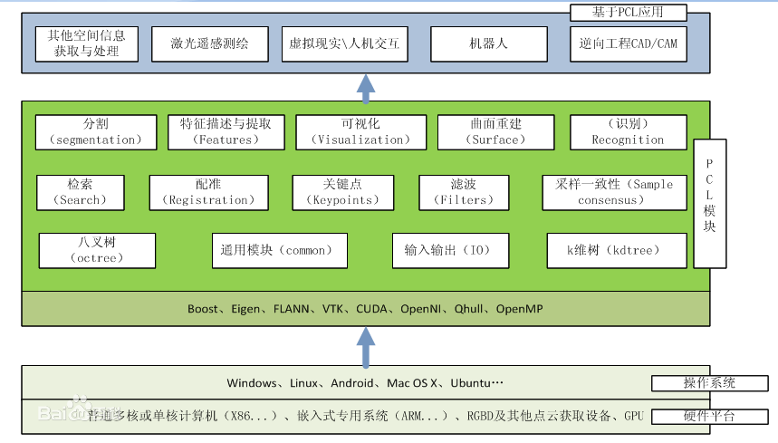
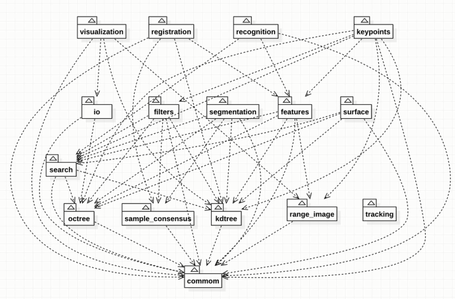

> 
> 😏*★,°*:.☆(￣▽￣)/$:*.°★* 😏  
>  这篇文章主要介绍pcl\_ros包使用与点云转换示例。  
>  **学其所用，用其所学。——梁启超**  
>  欢迎来到我的博客，一起学习，共同进步。  
>  喜欢的朋友可以关注一下，下次更新不迷路🥞
> 
> 
> 


#### 文章目录


* + [:smirk:1. pcl\_ros介绍](#smirk1_pcl_ros_7)
	+ [:blush:2. 环境安装与配置](#blush2__25)
	+ [:satisfied:3. 点云转换应用示例](#satisfied3__39)
	+ - [pcd\_pub节点](#pcd_pub_42)
		- [pcd\_sub节点](#pcd_sub_184)


### 😏1. pcl\_ros介绍


`pcl_ros`是一个用于将`PCL`（点云库）与`ROS`（机器人操作系统）集成的软件包。它提供了用于在ROS环境中处理和可视化点云数据的工具和功能。


以下是`pcl_ros`的主要功能和组件：


> 
> 1.ROS节点：pcl\_ros提供了一个ROS节点，用于订阅和发布点云数据。您可以使用该节点来接收来自传感器或其他节点的点云数据，并将处理后的点云数据发布到其他节点。
> 
> 
> 


> 
> 2.传感器接口：pcl\_ros提供了与ROS传感器消息（如sensor\_msgs::PointCloud2）之间的转换接口。您可以使用这些接口将ROS传感器消息转换为PCL点云对象（pcl::PointCloud），并进行进一步的处理。
> 
> 
> 


> 
> 3.可视化工具：pcl\_ros提供了用于在ROS环境中可视化点云数据的工具。您可以使用rviz等ROS可视化工具来显示和分析点云数据。
> 
> 
> 


> 
> 4.过滤器和特征提取：pcl\_ros包含了一系列的滤波器和特征提取功能，可以直接应用于ROS点云数据。您可以使用这些功能来对点云数据进行降噪、下采样、特征提取等操作。
> 
> 
> 


> 
> 5.点云转换：pcl\_ros提供了点云坐标系之间的转换功能。您可以使用这些功能来将点云数据从一个坐标系转换到另一个坐标系，以适应不同传感器或机器人系统的需求。
> 
> 
> 


> 
> 6.ROS参数服务器：pcl\_ros允许您使用ROS参数服务器来配置和调整点云处理的参数。您可以使用参数服务器来设置滤波器参数、特征提取参数等。
> 
> 
> 


通过将PCL和ROS相结合，`pcl_ros`使得在ROS环境中处理和操作点云数据更加方便和高效。它提供了丰富的功能和工具，使得点云数据的获取、处理和可视化变得更加容易。


### 😊2. 环境安装与配置


确认已经安装了ROS和PCL。


```
# pcl\_ros包安装
sudo apt install ros-noetic-pcl-ros

rosrun pcl_ros xxx # 启动节点
# 默认包含以下节点
bag_to_pcd
convert_pcd_to_image
convert_pointcloud_to_image
pcd_to_pointcloud
pointcloud_to_pcd

```

### 😆3. 点云转换应用示例


下面基于pcl\_ros包实现pcl读取pcd文件通过ros话题发布，以及ros订阅话题后通过pcl显示：


#### pcd\_pub节点


```
pcd_pub.cpp
#include <ros/ros.h>
#include <sensor\_msgs/PointCloud2.h>
#include <pcl\_conversions/pcl\_conversions.h>
#include <pcl/io/pcd\_io.h>
#include <pcl/point\_types.h>

int main(int argc, char\*\* argv)
{
    // 初始化ROS节点
    ros::init(argc, argv, "pcd\_publisher");
    ros::NodeHandle nh;

    // 创建一个ROS发布者，用于发布点云消息
    ros::Publisher pub = nh.advertise<sensor_msgs::PointCloud2>("pointcloud", 1);

    // 读取PCD文件
    pcl::PointCloud<pcl::PointXYZ>::Ptr cloud(new pcl::PointCloud<pcl::PointXYZ>);
    if (pcl::io::loadPCDFile<pcl::PointXYZ>("../test.pcd", \*cloud) == -1)
    {
        PCL\_ERROR("Failed to read PCD file\n");
        return -1;
    }

    // 创建一个ROS点云消息
    sensor_msgs::PointCloud2 output;
    pcl::toROSMsg(\*cloud, output);
    output.header.frame_id = "base\_link";  // 设置点云消息的坐标系

    ros::Rate loop\_rate(10);
    while (ros::ok())
    {
        // 发布ROS点云消息
        pub.publish(output);
        std::cout << "Published a point cloud." << std::endl;

        ros::spinOnce();
        loop_rate.sleep();
    }

    return 0;
}

```

CMakeLists.txt


```
cmake_minimum_required(VERSION 3.0.2)
project(pcd_pub)

## Compile as C++11, supported in ROS Kinetic and newer
add_compile_options(-std=c++14)

## Find catkin macros and libraries
## if COMPONENTS list like find\_package(catkin REQUIRED COMPONENTS xyz)
## is used, also find other catkin packages
find_package(catkin REQUIRED COMPONENTS 
  roscpp 
  rospy
  std_msgs
  sensor_msgs
  pcl_ros
)

find_package(PCL REQUIRED)

catkin_package(
  CATKIN_DEPENDS 
  roscpp 
  rospy 
  std_msgs 
  sensor_msgs 
  pcl_ros
)

###########
## Build ##
###########

## Specify additional locations of header files
## Your package locations should be listed before other locations
include_directories(
  include
  ${catkin\_INCLUDE\_DIRS}
  ${PCL\_INCLUDE\_DIRS}
)

add_executable(${PROJECT\_NAME} src/pcd_pub.cpp)

## Specify libraries to link a library or executable target against
target_link_libraries(${PROJECT\_NAME}
  ${catkin\_LIBRARIES}
  ${PCL\_LIBRARIES}
)

install(TARGETS pcd_pub
  RUNTIME DESTINATION ${CATKIN\_PACKAGE\_BIN\_DESTINATION}
)

```

package.xml


```
<?xml version="1.0"?>
<package format="2">
  <name>pcd_pub</name>
  <version>0.0.0</version>
  <description>The pcd_pub package</description>

  <!-- One maintainer tag required, multiple allowed, one person per tag -->
  <!-- Example:  -->
  <!-- <maintainer email="jane.doe@example.com">Jane Doe</maintainer> -->
  <maintainer email="xxx@todo.todo">xxx</maintainer>


  <!-- One license tag required, multiple allowed, one license per tag -->
  <!-- Commonly used license strings: -->
  <!--   BSD, MIT, Boost Software License, GPLv2, GPLv3, LGPLv2.1, LGPLv3 -->
  <license>TODO</license>

  <buildtool_depend>catkin</buildtool_depend>

  <build_depend>roscpp</build_depend>
  <build_depend>rospy</build_depend>
  <build_depend>std_msgs</build_depend>
  <build_depend>sensor_msgs</build_depend>
  <build_depend>pcl_ros</build_depend>

  <exec_depend>roscpp</exec_depend>
  <exec_depend>rospy</exec_depend>
  <exec_depend>std_msgs</exec_depend>
  <exec_depend>sensor_msgs</exec_depend>
  <exec_depend>pcl_ros</exec_depend>

  <!-- The export tag contains other, unspecified, tags -->
  <export>
    <!-- Other tools can request additional information be placed here -->

  </export>
</package>

```

#### pcd\_sub节点


```
// pcd\_sub.cpp
#include <ros/ros.h>
#include <sensor\_msgs/PointCloud2.h>
#include <pcl\_conversions/pcl\_conversions.h>
#include <pcl/visualization/cloud\_viewer.h>

pcl::visualization::CloudViewer viewer("PointCloud Viewer");

void cloudCallback(const sensor_msgs::PointCloud2ConstPtr& msg)
{
    pcl::PointCloud<pcl::PointXYZ>::Ptr cloud(new pcl::PointCloud<pcl::PointXYZ>);
    pcl::fromROSMsg(\*msg, \*cloud);

    // 获取点云数据的大小（字节数）
    size_t pointCloudSize = msg->data.size();

    ROS\_INFO("Received point cloud size: %zu bytes", pointCloudSize);

    if (!viewer.wasStopped())
        viewer.showCloud(cloud);
}

int main(int argc, char\*\* argv)
{
    ros::init(argc, argv, "pcl\_viewer");
    ros::NodeHandle nh;

    ros::Subscriber sub = nh.subscribe<sensor_msgs::PointCloud2>("pointcloud", 1, cloudCallback);

    ros::spin();

    return 0;
}

```

CMakeLists.txt和package.xml基本一致，除代码文件名不同外。


```
# 运行节点
catkin_make # 编译
source devel/setup.bash
rosrun pcd_pub pcd_pub # 发布
rosrun pcd_sub pcd_sub # 订阅

```

这样就实现了pcd点云与ros话题之间的转换，此外还可以利用ros的可视化工具如rviz进行查看。


## 一、PCL介绍和学习路径
### PCL介绍

	点云数据的处理可以采用获得广泛应用的Point Cloud Library (点云库，PCL库)。
	PCL库是一个最初发布于2013年的开源C++库。它实现了大量点云相关的通用算法和高效的数据管理。
	支持多种操作系统平台，可在Windows、Linux、Android、Mac OS X、部分嵌入式实时系统上运行。
	PCL是BSD授权方式，可以免费进行商业和学术应用。
**如果说OpenCV是2D信息获取与处理的技术结晶，那么PCL在3D信息获取与处理上，就与OpenCV具有同等地位**
	
下面是PCL架构图：

如图PCL架构图所示，对于3D点云处理来说，PCL完全是一个的模块化的现代C++模板库。其基于以下第三方库：Boost、Eigen、FLANN、VTK、CUDA、OpenNI、Qhull，实现点云相关的获取、滤波、分割、配准、检索、特征提取、识别、追踪、曲面重建、可视化等。



每个模块都有依赖关系，依赖关系如下图（可以看出有四层），最基本的就是最底层的commom模块。	
箭头对应的是依赖关系，比如第二层的kdtree依赖于common；第四层的registration有四个箭头，分别是sample_consensus, kdtree, common, features。



### PCL学习路径
入门资料：		
视频：[bilibili-PCL点云库官网教程](https://space.bilibili.com/504859351/channel/series)		
github：[点云库PCL学习教程书籍每章总结](https://github.com/MNewBie/PCL-Notes)

代码实践：	
官方各模块demo-[wiki](https://pcl.readthedocs.io/projects/tutorials/en/latest/#)	
模块对应的对象和函数-[docs-modules](https://pointclouds.org/documentation/modules.html)		
具体模块的学习-有针对性（看双愚的系列文章	）		
pcl实践[黑马pcl-3d点云](https://robot.czxy.com/docs/pcl/)		
CSDN博主系列文章[PCL学习(64篇)](https://www.cnblogs.com/li-yao7758258/category/954066.html)

## 二、PCL安装配置
pcl源代码编译安装：[see this](https://robot.czxy.com/docs/pcl/env/pcl/)

ubuntu安装好ros后，还需要安装pcl-tools：`sudo apt install pcl-tools`，才能使用pcl_viewer等工具。

二进制安装：`ros-noetic-pcl-ros`，默认版本1.10

总结：源码编译会出现莫名其妙的错误，比如我就出现可视化的库找不到和一些操作符过期的问题。最终，大家都用ros的pcl就好了，兼容性特别好！

## 三、PCL各模块学习
### PCL中常用的PointT类型
PointXYZ——成员变量：float x,y,z;

PointXYZ是使用最常见的一个点数据类型，因为他之包含三维XYZ坐标信息，这三个浮点数附加一个浮点数来满足存储对齐，可以通过points[i].data[0]或points[i].x访问点X的坐标值
```
union
{
float data[4];
struct
{
float x;
float y;
float z;
};
};
```
PointXYZI——成员变量：float x,y,z,intensity

PointXYZI是一个简单的X Y Z坐标加intensity的point类型，是一个单独的结构体，并且满足存储对齐，由于point的大部分操作会把data[4]元素设置成0或1（用于变换），不能让intensity与XYZ在同一个结构体中，如果这样的话其内容将会被覆盖，例如：两个点的点积会把第四个元素设置为0，否则点积没有意义。
```
union{
float data[4];
struct
{
float x;
float y;
float z;
};
};
union{
struct{
float intensity;
};
float data_c[4];
};
```

通用编译方法：`mkdir build && cd build && cmake .. && make`

### 基础-pcd写入和读取

### kd-tree

### oc-tree 

## 四、PCL实践

以上。


