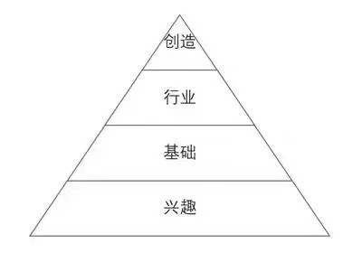

# DevFrank Wiki

Welcome to my wiki ! ———— 修车转修电脑❤！

<!-- <iframe frameborder="no" border="0" marginwidth="0" marginheight="0" width=330 height=86 src="//music.163.com/outchain/player?type=2&id=488249475&auto=1&height=66"></iframe> -->

此网站基于MkDocs搭建。

## 主要方向

### 1. 对集体

**“机器人和人工智能”**是当前科学与工程领域的热门方向。在学术领域，自动驾驶是这个方向下的一门交叉学科，融合了车辆、电子、通信、计算机等学科知识；在工业领域，目前已基本形成以主机厂为中心，传感器、芯片、线控底盘为重要组成部分的供应商格局。如下图：

### 2. 对个人

对于我们个人来说，对一个行业的认识是从**兴趣、基础、实践到创新**的。尤其是刚毕业的学生，其实在大学也是这样的，对一件事情有兴趣才会去做，然后要学习基础知识，通过参加竞赛或工作积累实践经验，最后才能有机会去对所做的事情做一些创新。

另外，**对公司有价值、能解决问题**是工程师的立身之本；因此我们最好有**一专多能**。

项目一定是团队协作的，协作的前提是沟通，沟通不仅是项目经理、产品经理的专属技能，每个开发工程师也需要学会表达，推销自己的产品和技能。

对于个人来说，掌握通用技能很有必要，可参考以下知识体系：

### 3. 学习网站

- [tsinghua](https://mirrors.tuna.tsinghua.edu.cn/)
- [ustc](http://mirrors.ustc.edu.cn/)
- [zju](http://mirrors.zju.edu.cn/)
- [aliyun](http://mirrors.aliyun.com/)

- [国家高等教育智慧教育平台](https://higher.smartedu.cn/)
- [菜鸟教程-学习编程](https://www.runoob.com/)
- [创客智造-开源软硬件](https://www.ncnynl.com/)
- [智能网联在线知识平台](https://www.cae-edu.com/)
- [Autolabor ros-robot](http://www.autolabor.com.cn/book/ROSTutorials/)
- [传智教育-robot](https://robot.czxy.com/docs/)

## 学习建议

比如，我的专业是车辆工程，目前的科技发展是向着机器人与人工智能-自动驾驶方向的，自己也对这方面感兴趣，因此就去主动地拥抱新领域，学习新知识，积极参加实践。听我的，如果你对一件事情有兴趣，肯定会主动去做的，否则就还是兴趣不够。

但学校的教学与当前科技的快速发展肯定是有差距的，因此学校培养的只是知识体系和学习能力，后续在工作实践中通过对知识的继续了解和深入来对知识体系进行扩充，要明白这一点。

### 1. 善用互联网资源感知信息

互联网时代了，只要你会用百度（Google），你就有一定的信息检索能力，具体怎么检索就不谈了。信息大爆炸的时代，我们可以从各种自媒体、网站、书籍、论文、会议等途径了解到大量的信息，但别高兴太早，信息有了只是有了“感”，如果不会“知”，也就是不会处理信息，大量的信息只会给自己带来困扰。解读信息比信息本身更重要。（接收信息——分析信息——转变自己） 

那么，如何“知”呢？我的建议是首先要有自己的知识体系，可以是一个思维导图，当接收到新东西的时候就补到自己的体系中，在不断的积累中这棵大树将枝繁叶茂。

对，一定要将学到的东西转化为自己的东西，这样才算学到，才算“感”和“知”。

### 2. 确立目标并规划执行

在整理好当前的信息后，要结合自身的情况来确立目标，然后规划出未来一段时间内将要做的事情。

我目前的基础还很差，但我目前有机器人玩具实践经验，如果要成为规控工程师，我还需要怎么做？

1. 加快信息感知和知识转化
2. 多进行自动驾驶规控方向实践

有了规划后，要对自己进行自律，然后确保行动的执行。

经常对过去做总结，对现在做优化，对未来做规划。

最后，祝大家工作顺利、家庭幸福。

以上！
